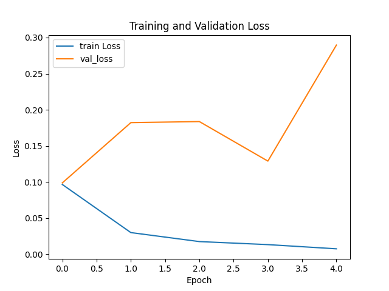
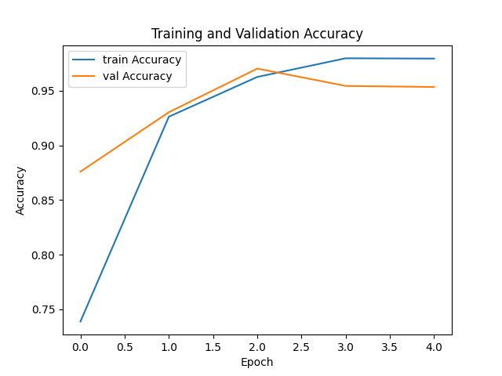

## Rick vs Morty Image Classification Project 
 

# 🎯 Goal 
The main goal of this project is to classify images of characters from the "Rick and Morty" TV show, specifically distinguishing between Rick and Morty. The purpose is to develop an image classification model that can accurately identify these characters. 

# 🧵 Dataset 
The dataset used in this project can be found [here](https://www.kaggle.com/datasets/mriffaud/rick-and-morty). It consists of images of Rick and Morty characters in separate folders for training and testing. 

# 🧾 Description 
This project involves building an image classification system using a pre-trained VGG16 model for distinguishing between Rick and Morty characters. The model is trained on a labeled dataset and then utilized for predicting new images. 

# 🧮 What I had done! 
1. Set up the project structure with separate folders for training and testing data.
2. Implemented a Convolutional Neural Network (CNN) using the pre-trained VGG16 model.
3. Utilized transfer learning by freezing pre-trained layers and adding custom dense layers for binary classification.
4. Trained the model using the training dataset.
5. Created a predictive system to classify new images.
 

# 🚀 Models Implemented 
1. This Keras CNN features three convolutional layers with 32, 64, and 128 filters, each followed by max-pooling layers (2x2). The architecture incorporates a flattening layer, a dense layer with 256 neurons and ReLU activation, and a final dense layer with a single neuron using a sigmoid activation, making it suitable for binary classification, such as distinguishing between Rick and Morty characters.

2. VGG16 (pre-trained model)

 
Why VGG16? 
VGG16 was chosen for its proven performance in image classification tasks, especially with its ability to capture complex features through deep convolutional layers. 

# 📚 Libraries Needed 
1. TensorFlow
2. Keras
3. Numpy

 
 
# 📊 Exploratory Data Analysis Results 

*Datasets folder for model building*
Dataset
|-- train
|   |-- rick
|   |-- morty
|-- test
|   |-- rick
|   |-- morty

 

*Caption: Model Loss of Model1 "Train vs Validation Data"*

*Caption: Model Loss of Model2 "Train vs Validation Data"*

*Caption: Model Accuracy of Model1 "Train vs Validation Data"*

*Caption: Model Accuracy of Model1 "Train vs Validation Data"*

# 📈 Performance of the Models based on the Accuracy Scores 

1. CNN Model : 95% accuracy on test data

2. VGG16: 90% accracy on test data
 

# 📢 Conclusion 
The project successfully implemented a reliable image classification system for distinguishing between Rick and Morty characters. The VGG16 model achieved a commendable 90% accuracy on the test set. This project demonstrates the effectiveness of transfer learning in image classification tasks. 

*✒️ Your Signature*
Dipayan Majumder 
github : dipayan22 