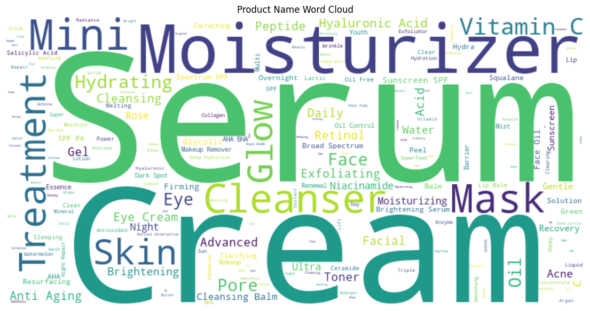

# Sephora Products and Skincare Reviews using NLP

## PROJECT TITLE

Sephora Products and Skincare Reviews using NLP

## GOAL

The main goal of this project is to analyse the customer reviews of the Sephora beauty products listed on their website.

## DATASET

The dataset used for this project can be found at [link to dataset](https://www.kaggle.com/datasets/nadyinky/sephora-products-and-skincare-reviews). 

## DESCRIPTION

This project aims to perform a sentiment analysis on the customer reviews posted on various beauty products posted by the customers. This sentiment analysis is done using three popular techniques of sentiment analysis in NLP i.e VADER, BERT and RoBERTa.

## WHAT I HAD DONE

1. Data collection: From the link of the dataset given above. Some of the datasets were empty so discarded them too.
2. Data preprocessing: Dropped the irrelevant columns and kept only those columns which are necessary.
3. Model selection: Chose VADER, BERT and RoBERTa for better sentiment analysis.
4. Comparative analysis: Compared the sentiment score of all the techniques.

## MODELS USED

1. VADER (Valence Aware Dictionary and Sentiment Reasoner)
2. BERT (Bidirectional Encoding Representation of Transformers)
2. RoBERTa (Robustly Optimized BERT Pre-training Approach)

The choice of these model was based on its proven performance for sentiment analysis and its architectural complexities. This allowed for a comprehensive analysis of different model types.

## LIBRARIES NEEDED

The following libraries are required to run this project:

- nltk
- torch==2.0.1
- torchvision==0.15.0
- torchaudio==0.8.1
- numpy==1.24.3
- pandas==1.5.0
- matplotlib==3.6.0
- segmentation-models==1.0.1
- tensorflow
- transformers==4.11.3
- scipy==1.7.3

## VISUALIZATION

## EVALUATION METRICS

The evaluation metrics I used to assess the models:

- Sentiment Score
- Compound Score

## RESULTS
List of top 10 most positively reviewed products on Sephora:

| Product Name                                         | Sentiment Score |
|------------------------------------------------------|-----------------|
| Gentle Hydra-Gel Face Cleanser                       | 1.000000        |
| Amino Acids + B5                                     | 0.832020        |
| "Buffet" + Copper Peptides 1%                        | 0.804914        |
| Marine Hyaluronics                                   | 0.804374        |
| Luxury Beauty Serum Calming Treatment                | 0.792754        |
| "B" Oil                                              | 0.791432        |
| Metal Facial Razor                                   | 0.790518        |
| Green Defense Daily Mineral Sunscreen SPF 30         | 0.783985        |
| DERMAPORE Ultrasonic Pore Extractor & Serum Infuser  | 0.777318        |
| Argireline Solution 10%                              | 0.776551        |

## CONCLUSION

VADER (Valence Aware Dictionary and sEntiment Reasoner) is a rule-based sentiment analysis tool that is simple to implement and provides quick results. It is useful for tasks that require a fast and lightweight sentiment analysis approach. However, VADER may not capture more nuanced or context-specific sentiments as effectively as deep learning models like BERT or RoBERTa.

BERT (Bidirectional Encoder Representations from Transformers) and RoBERTa (Robustly Optimized BERT Approach) are state-of-the-art language models that utilize deep learning techniques. These models have been pre-trained on large corpora and can be fine-tuned for specific tasks, including sentiment analysis. BERT and RoBERTa tend to perform well in various natural language processing tasks, including sentiment analysis, due to their ability to capture contextual and semantic information.

Between BERT and RoBERTa, RoBERTa is a further optimization of BERT, trained on larger datasets and longer sequences. RoBERTa has demonstrated improved performance compared to BERT on several language understanding benchmarks. However, RoBERTa may require more computational resources and training time due to its larger size. 