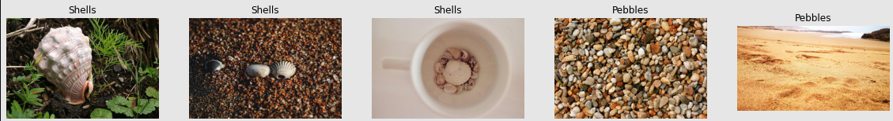
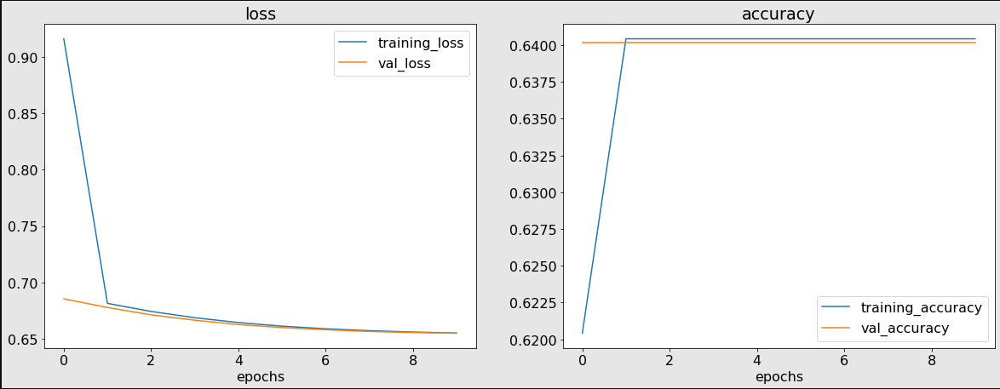
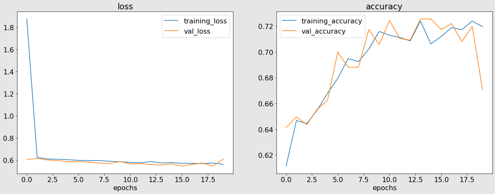
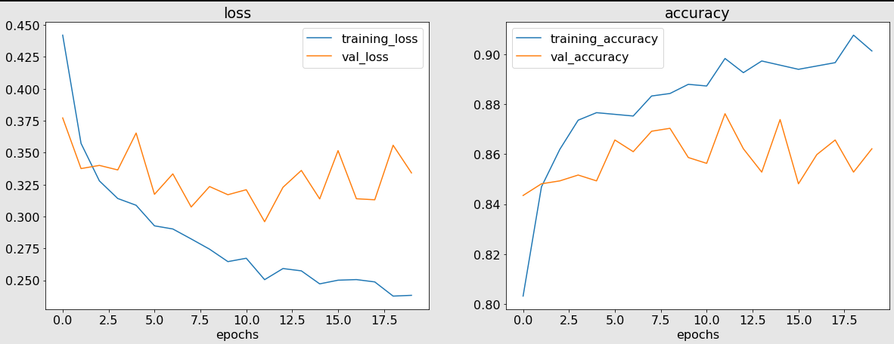
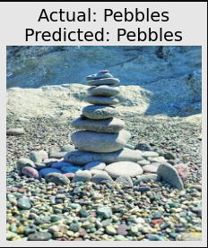

# Shells and Pebbles Detection

**GOAL**

To classify the images from the Shells and Pebbles Dataset using a Deep Learning approach.

**DATASET**

https://www.kaggle.com/datasets/vencerlanz09/shells-or-pebbles-an-image-classification-dataset

**DESCRIPTION**

The dataset contains images of 2 different classes, namely Shells and Pebbles. There are 1541 and 2743 images of each type respectively. The task is to classify the images by using a deep learning architecture.

**WHAT I HAD DONE**

First I imported all the required libraries and dataset for this project. Then I imported the dataset and split it into training, validation and testing sets in the ratio 70:20:10. Then I proceeded to build the model. 

I have developed 4 deep learning models to classify the images. First I used a ANN to classify the images. But I didn't get a good accuracy. Secondly I used a CNN to classify the images, but the model wasn't performing well. Lastly, I used a CNN with MaxPooling layers but I didn't get a satisfactory accuracy score. 

Then I proceeded with Transfer Learning. I used the [ResNet 50](https://tfhub.dev/google/imagenet/resnet_v2_50/feature_vector/5) model and trained this model on the images from the dataset. I first got some improvements in the accuracy, after training the model I got an accuracy score of 82.55

**MODELS USED**

The models are:

1. Artificial Neural Network (ANN)
2. Convolutional Neural Network (CNN)
3. Convolutional Neural Network (CNN) with MaxPooling layer
4. Transfer Learning Model (ResNet)

**LIBRARIES NEEDED**

* kaggle
* tensorflow
* tensorflow_hub
* split-folders
* matplotlib

**VISUALIZATION**

### Images of different Rice classes

### Model 1 (ANN Model) performance graphs

### Model 2 (Basic CNN Model) performance graphs

### Model 3 (CNN Model with MaxPooling layer) performance graphs

### Model 4 (Transfer Learning Model (ResNet)) performance graphs

### Prediction

Prediction on a random image from the testing dataset.

**ACCURACIES**

| Model         | Architecture              | Accuracy in % (on testing data) |
| ------------- |:-------------------------:|:-------------:|
| Model 1       | ANN Model                 |63.95          |
| Model 2       | Basic CNN Model           |70.69          |
| Model 3       | CNN Model with MaxPooling |72.79          |
| Model 4       | Transfer Learning Model (ResNet) 20 epochs |82.55          |

**CONCLUSION**

I was successfully able to develop a Deep Learning model that can classify images from the given Shells and Pebbles dataset of 2 classes.

**Omkar Jahagirdar**

Connect with me on Linkedin: https://www.linkedin.com/in/omkar-jahagirdar/

Check out my Github profile: https://github.com/omkar3602
