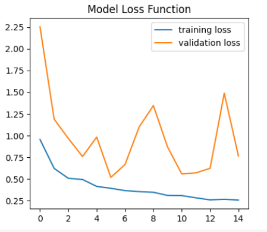

# Ship Image Classification Using Deep Learning

## PROJECT TITLE

Ship Image Classification Using Deep Learning

## GOAL

The main goal of this project is to analyse ship images using deep learning
.png>)

## DATASET

The dataset used for this project can be found at https://www.kaggle.com/datasets/arpitjain007/game-of-deep-learning-ship-datasets
## DESCRIPTION

This project aims to detect ship images using deep learning models- VCGNET, DENSENET, XCEPTION  CNN models. We compare on the basis of accuracy and loss.

## WHAT I HAD DONE
1. Group dataset by classes and done eda
2. Then we use use image augmentation and use pretrained robust model  XCeption to analyze data
3. Following that we design a VCGNET model with adam optimizer
4. Now, densenet model is designed with densenet , globalpooling layers and exponential decay
5. Compare loss and accuracies

## MODELS USED

1. VCGNET
2. XCEPTION
3. DENSENET

## LIBRARIES NEEDED

The following libraries are required to run this project:
- tensorflow
- keras
- matplotlib
- seaborn
- numpy 
- pandas

## VISUALIZATION

.png>)
.png>)

## RESULTS

| Model      | Accuracy | Loss    |
|------------|----------|---------|
| XCEPTION   | 0.90     | 0.26    |
| VCGNET     | 0.91     | 0.22    |
| DENSENET   | 0.95     | 0.11    |

## CONCLUSION
DenseNet, short for Densely Connected Convolutional Networks, excels in image recognition tasks by promoting dense connections between layers. The densely connected structure allows each layer to receive direct input from all preceding layers, facilitating feature reuse and enhancing gradient flow during training. This results in a more efficient and parameter-sharing model, particularly effective when dealing with complex patterns and dependencies in ship images. The high accuracy of 0.95 and low loss of 0.11 for DenseNet  suggest that the model effectively captures intricate ship features, contributing to superior identification performance.

VCGNet, though slightly less accurate than DenseNet with an accuracy of 0.91,has  unique architectural or training strategies that make it well-suited for ship identification.In summary, DenseNet's dense connections and efficient parameter sharing likely contribute to its superior ship identification capabilities, while VCGNet's specific architectural or training strategies enable it to perform well, albeit at a slightly lower accuracy compared to DenseNet.

#### Aindree Chatterjee