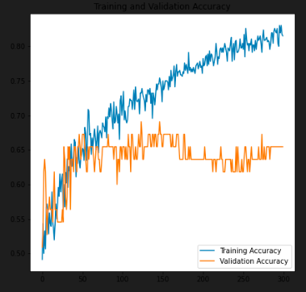
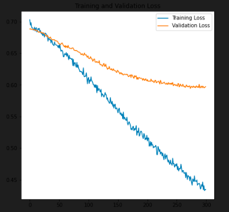

#
## Shoes Classification

**GOAL**

Create a model to identify the brands of the shoes.

**DATASET :**
[https://www.kaggle.com/datasets/ifeanyinneji/nike-adidas-shoes-for-image-classification-dataset](https://www.kaggle.com/datasets/ifeanyinneji/nike-adidas-shoes-for-image-classification-dataset)

**DESCRIPTION**
The dataset contains images of 2 different Brands of Shoes Nike and Adidas and has 230 images respectively. The task is to classify the images by using a deep learning architecture

**WHAT I HAD DONE**

**MODELS USED**

The models are:

  

1. Support Vector Machine(SVM)

2. Convolutional Neural Network (CNN)
  

**LIBRARIES NEEDED**
* kaggle
* tensorflow
* split-folders
* matplotlib
* pandas
* pickle

 
# **Image Classification Using Machine Learning-Support Vector Machine(SVM)**

# Introduction

  

**Machine learning** is an application of artificial intelligence, which allows the computer to operate in a self-learning mode, without being explicitly programmed. It is a very interesting and complex topic, which could drive the future of technology.

  

There are copious applications of Machine learning, out of which Image Classification is one. To classify images, here we are using SVM. Scikit-learn is a free software machine learning library for the Python programming language and Support vector machine(SVM) is subsumed under Scikit-learn.

  

# Tools Used

  

→ Python syntax

→ Pandas library for data frame

→ Support vector Machine(svm) from sklearn (a.k.a scikit-learn) library

→ GridSearchCV

→ skimage library for reading the image

→ matplotlib for visualization purpose

  

First, let’s understand the concept and dive into the coding part 😉

  

# **Support Vector Machine(SVM)**

  

“Support Vector Machine” (SVM) is a supervised machine learning algorithm that can be used for both classification or regression challenges. However, it is mostly used in classification problems. In this SVM algorithm, we plot each data item as a point in n-dimensional space (where n is the number of features you have) with the value of each feature being the value of a particular coordinate. Then, we perform classification by finding the hyper-plane that differentiates the two classes very well.

  

Some of the key parameters in SVM are:

→ **Gamma** : defines how far the influence of single training examples reaches values leads to biased results.

  

**→ C :** Controls the cost of miscalculations

Small C — makes the cost of misclassification LOW

Large C — makes the cost of misclassification HIGH

  

→ **Kernel :** SVM algorithms use a set of mathematical functions that are defined as the kernel.

Types of Kernels are: Linear, RBF(Radial Basis Function), Polynomial Kernel

  

  

More about SVM can be learned from [here](https://scikit-learn.org/stable/modules/svm.html).

  

# **How Does the Computer Read The Image? 🤔**

  

The main task of image Classification is to read the input image, the computer sees the image quite differently:

  

  

The computer sees the image as an array of pixels, if the size of the image is 200 X 200, the size of the array will be 200 X 200 X 3 wherein the first 200 is the width and second 200 is height and the next 3 is RGB channel values. The values in the array would range from 0–255 which describes the intensity of the pixel at each point.

  

# **GridSearchCV**

  

It is a library function that is a member of sklearn’s model_selection package. It helps to loop through predefined hyperparameters and fit your estimator (model) on your training set. So, in the end, you can select the best parameters from the listed hyperparameters.

  

Enough of theory, let’s get started with the coding part.

  

# **Process**

  

It is one of the ways of machine learning where the model is trained by input data and expected output data.

To create such a model, it is necessary to go through the following phases:

  

1.Taking input

2. Model construction

3. Model training

4. Model testing

5.Model evaluation

  

**Taking input:** 3 Different categories of images(Cars, Ice cream cone, Cricket ball) are read and labeled as 0,1,2 in the following way:

  

Since SVM receives inputs of the same size, all images need to be **resized** to a fixed size before inputting them to the SVM. df is the data frame created using pandas and x and y are input and output data respectively

  

**Model construction:** In this project case, the model is Support vector machine.

The algorithm for model construction looks like this:

1. Create a support vector classifier:

→ svc=svm.SVC()

2. With the help of GridSearchCV and parameters grid, create a model: →model=GridSearchCV(svc,parameters_grid)

  

**Model training:** The data is split into two categories: training data and testing data. Training data is used to train the model whereas testing data is used to test the trained model.

For splitting the data into training and testing, **train_test_split()** from sklearn library is used.

Model is trained using training data in this way

→ model.fit(training_data,expected_output)

  

**Model testing:** Now the model is tested using testing data in this way

→ model.predict(testing_data)

  

The accuracy of the model can be calculated using the **accuracy_score()** method from sklearn.metrics

  

Finally, in the **Model evaluation** phase, the model generated can be used to evaluate new data.

  

  
  

The final output would be like this:

  

# **Conclusion:**
In this work, I assembled and trained the SVM model to classify images of nike shoes and adidas shoe. I used GridSearchCV to find out the best parameters for SVM to classify the images and have measured the accuracy of the model.

# **Image Classification Using Machine Learning-Convolution Neural Network(CNN)**

## CNN Performance Graphs

**ACCURACIES**

| Model         | Architecture              | Accuracy in % (on testing data) |
| ------------- |:-------------------------:|:-------------:|
| Model 1       | SVM                       |72.50          |
| Model 2       | Basic CNN Model           |82.33          |

## Connect with me on
### [LinkedIn - Adithya S Kolavi](https://www.linkedin.com/in/adithya-s-kolavi-127a561a8/)
### [Github - adithya_s_k](https://github.com/adithya-s-k)
