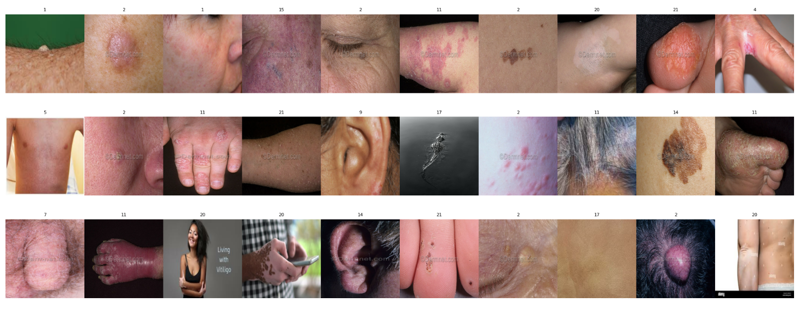
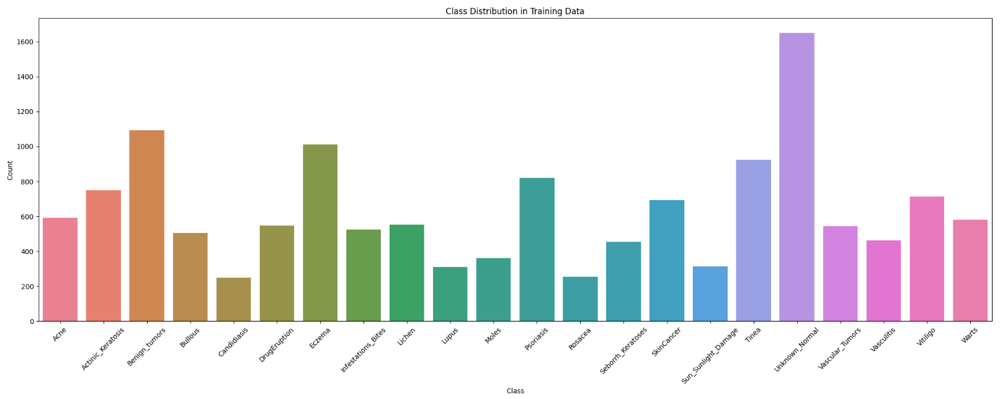
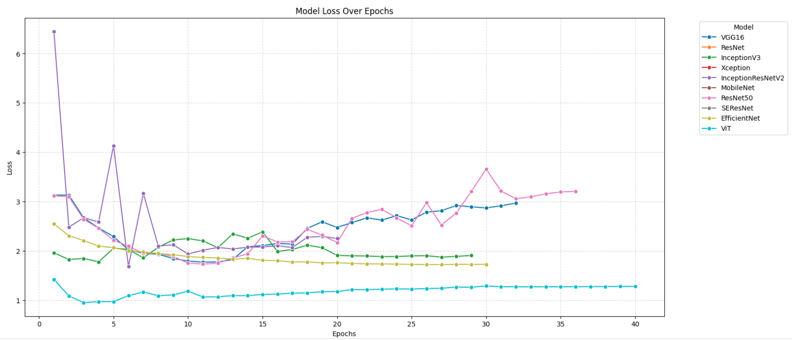
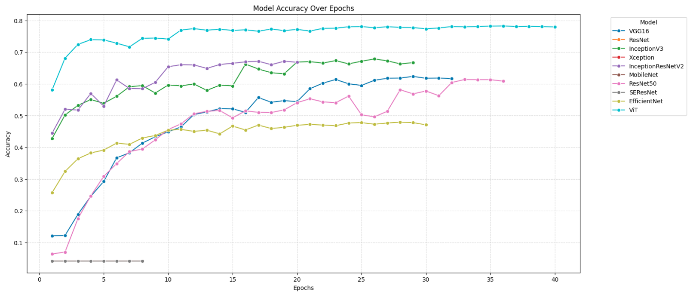
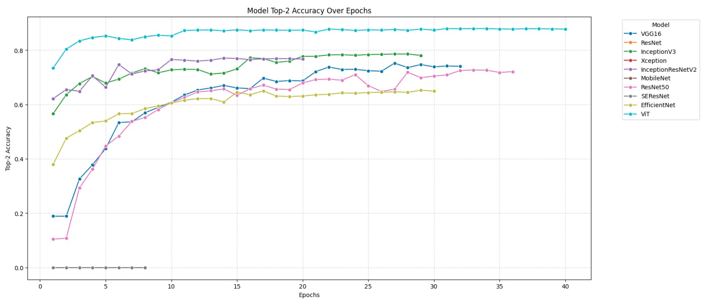

# 🧴 Skin Disease Classification with Deep Learning 🧴

> A comparative analysis of 10 different deep learning models for skin disease classification.

## 🎯 Goal

The aim of this project is to classify images of skin diseases into different categories by comparing various state-of-the-art deep learning architectures. We evaluated ten models, including transfer learning with pre-trained ImageNet weights, and identified the best-performing model for this specific task.

## 📊 Dataset

The dataset used for this project can be found on Kaggle: [Skin Disease Dataset](https://www.kaggle.com/datasets/pacificrm/skindiseasedataset/data). This dataset contains images of different types of skin diseases, providing a valuable resource for training and evaluating the model's performance.

### 🌐 Comprehensive Collection

This dataset comprises a diverse collection of images representing various skin diseases. The dataset images are categorized into 22 distinct classes, each corresponding to a specific skin condition.

### 🌈 Diverse Skin Conditions

The following are the classes included in the dataset:

- **Acne**
- **Actinic Keratosis**
- **Benign Tumors**
- **Bullous**
- **Candidiasis**
- **Drug Eruption**
- **Eczema**
- **Infestations/Bites**
- **Lichen**
- **Lupus**
- **Moles**
- **Psoriasis**
- **Rosacea**
- **Seborrheic Keratoses**
- **Skin Cancer**
- **Sun/Sunlight Damage**
- **Tinea**
- **Unknown/Normal**
- **Vascular Tumors**
- **Vasculitis**
- **Vitiligo**
- **Warts**

### 📷 Data Visualization and Class Distribution

We visualized the data to understand the sample characteristics for each class of skin disease. The following plots illustrate sample images and the class distribution:

1. **Data Visualization**
   

2. **Class Distribution**
   

## 🧠 Models Used

In this project, we evaluated the following ten deep learning architectures:

1. **VGG16**
2. **ResNet**
3. **InceptionV3**
4. **Xception**
5. **InceptionResNetV2**
6. **MobileNet**
7. **ResNet50**
8. **SEResNet**
9. **EfficientNet**
10. **Vision Transformer (ViT)**

Each model (except SEResNet) utilized pre-trained weights from ImageNet, which provided a strong starting point for training. We observed that SEResNet, due to its lack of pre-training, performed significantly worse compared to other models. Among the models evaluated, **Vision Transformer (ViT)** yielded the best results in terms of both accuracy and generalization.

## 📈 Results

### 🔍 Performance Metrics

We compared each model on the following metrics:

- **Loss**: Tracking the loss during training and validation helped identify the stability of each model's learning process.
- **Accuracy**: The primary metric used to gauge model performance.
- **Top-2 Accuracy**: Provided insight into cases where the model's second choice was also relevant.

The following plots provide a comparative visualization for each model's performance:

1. **Loss**
   
2. **Accuracy**
   
3. **Top-2 Accuracy**
   

## 🚀 How to Run

To replicate this analysis, clone the repository and follow these steps:

1. Install the required dependencies:
   ```bash
   pip install -r requirements.txt
   ```
2. Now you can run each cell of Notebook.

## 🤝 Contributor

Developed by **Prashant Kumar Mishra**  
GitHub: [Profile Link](https://github.com/pacificrm)  
LinkedIn: [Prashant Kumar Mishra](https://www.linkedin.com/in/pacificrm)  
Kaggle : [Profile Link](https://www.kaggle.com/pacificrm)
