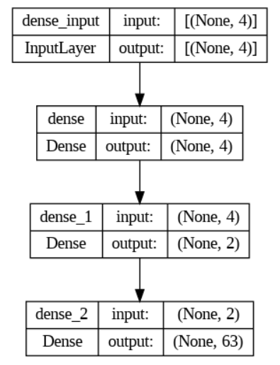

**Smartphone processor classification**

**GOAL**

To classify the different processors of smartphones on the basis of collected data.

**DATASET**

https://www.kaggle.com/datasets/alanjo/smartphone-processors-ranking

**DESCRIPTION**

By this project I have done classification of the different processor of smartphones with the help of ANN algorithm.

**WHAT I HAD DONE**

1.First I have imported different libraries like pandas, numpy, tensorflow,keras and etc.
2.Then I analyze the data and filter out the features which has the impact on the output.
3.Then I create two sets one of output and other of input.
4.Then I split data in train and test.
5.Then I apply the ANN model to it.

**MODELS USED**

I have implemented the ANN model to the project to get the better accuracy than the simple algorithms

**LIBRARIES NEEDED**

1.pandas 
2.numpy 
3.tensorflow
4.keras
5.matplotlib.pyplot 
6.sklearn.
7.pydot
8.ann_visualizer
9.graphviz

**VISUALIZATION**

**ACCURACIES**

ANN model provies the accuracy of approx 17 percent.
loss: 4.1214 - accuracy: 0.1702

**CONCLUSION**

By this model I have classified different processor on the basis of different processor scores.
This model gave me 17 percent accuracy.
It is low due to the less data in the dataset.
and there is no other dataset available on google.

**YOUR NAME**

Mohammed Owais
