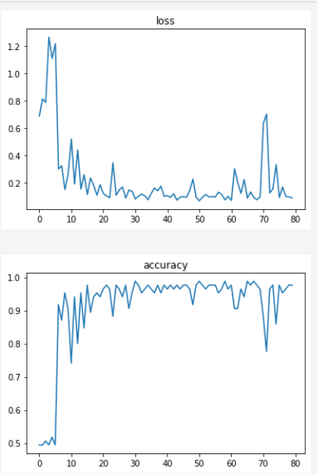

**PROJECT TITLE**
Smile Recognition with Deep Learning

**GOAL**
Smile Recognition with Deep Learning

**DATASET**
https://www.kaggle.com/datasets/chazzer/smiling-or-not-face-data

**DESCRIPTION**
The project uses CNN model and DenseNet model. And then we compare performance of our 2 models in recognizing smiling faces and separating between a smiling and a non-smiling face

**WHAT I HAD DONE**
1. Created a dataset from the pictures, which led us to discover an almost perfectly balanced dataset with pictures of both categories in 1:1 ratio.
2. The data streams are created for training, validation, and testing datasets. These data streams will generate batches of data for each iteration.The function returns three generator objects (train_ds, valid_ds, and test_ds) which can be used to iterate over the data streams.
3. We create a function,in which we use data generators to perform image data augmentation and apply the MyDenseNet model.
4. Then we create the Densenet neural network model and observe accuracy. We plot charts for accuracy and value loss
5. We also create a CNN model to do the same tasks

**MODELS USED**
CNN, Densenet

**LIBRARIES NEEDED**
Pandas, Numpy, Keras,TensorFlow, ScikitLearn, Seaborn, Matplotlib

**VISUALIZATION**
 - PERFORMANCE OF CNN
 - PERFORMANCE OF DENSENET

**ACCURACIES**
Standard CNNs over 98% accuracy as against 95% accuracy for DenseNet Model used

**CONCLUSION**

While DenseNet and traditional Convolutional Neural Networks (CNNs) are both effective for recognizing smiling faces, CNNs often provide higher accuracy due to their ability to capture hierarchical features through convolutional layers. DenseNet's dense connectivity may result in more parameters and computations, making it potentially more resource-intensive. In smile recognition tasks where nuanced facial features matter, CNNs excel by efficiently learning hierarchical representations, leading to superior accuracy compared to DenseNet. This explains CNN's 98% over the 95% of DenseNet
**YOUR NAME**
Aindree Chatterjee