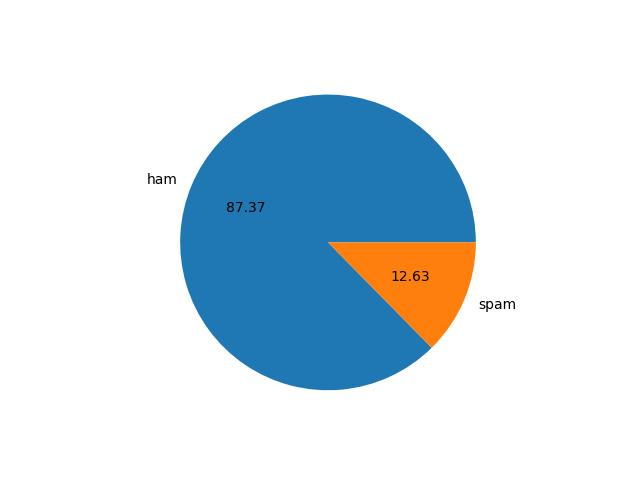
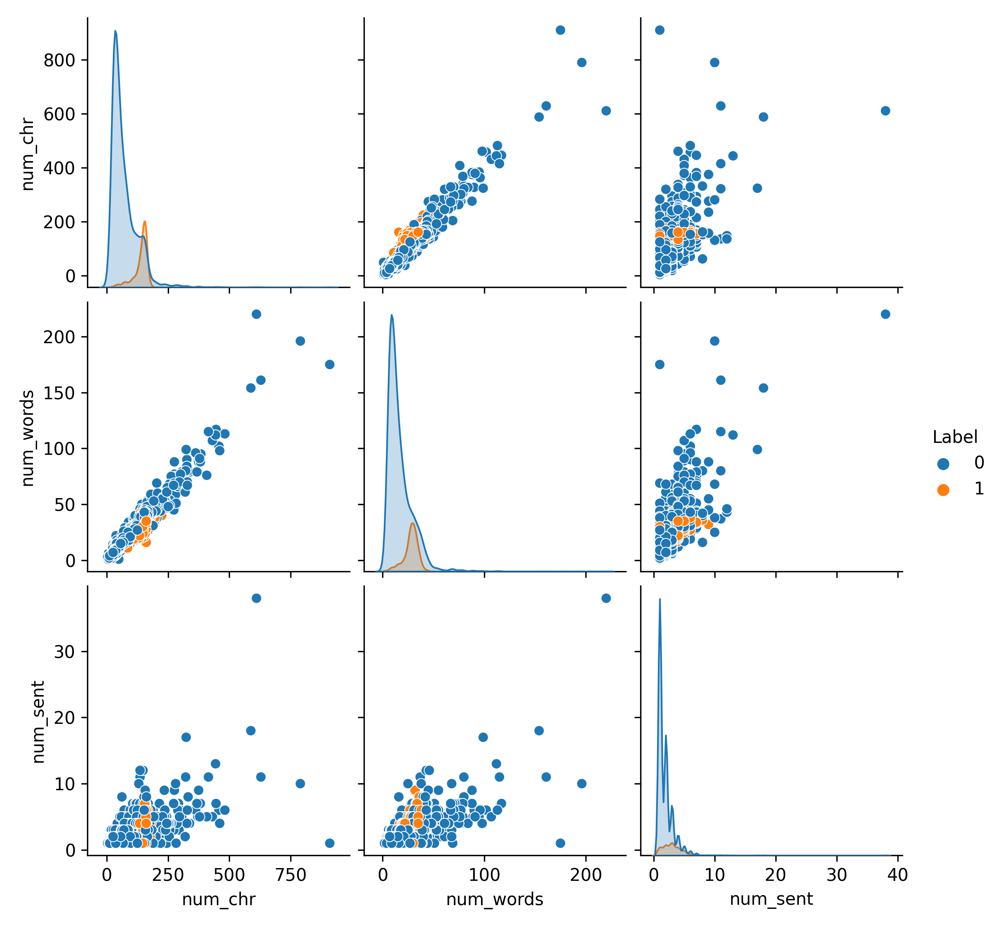

# SPAM vs HAM Email Classification 

## 🎯 Goal 

The main goal of this project is to develop a robust deep learning model for classifying emails as either spam (SPAM) or legitimate (HAM). Additionally, the project aims to create a Streamlit GUI for a user-friendly interface in real-time email classification. 

## 🧵 Dataset 

The dataset used for this project is available [here](https://www.kaggle.com/datasets/omokennanna/simple-spam-classification). It consists of two columns: 'text' containing the email content and 'label' indicating whether the email is spam or ham. 

## 🧾 Description 

This project utilizes a deep learning model with an embedding layer, bidirectional LSTM layers, and a dense output layer. The model is trained on the provided dataset to classify emails as spam or ham. A Streamlit GUI is implemented to enable users to perform real-time email classification. 

## 🧮 What I had done! 

### 1. Data Preparation 

- The dataset is loaded and split into training and testing sets. 
- Missing values are handled, and the text data is preprocessed. 

### 2. Model Architecture 

- The Machine learning model I used several algorithm for better accuracy. 

- The deep learning model comprises an embedding layer, LSTM layers, and a dense output layer with a sigmoid activation function. 

- The deep learning model comprises an embedding layer, bidirectional LSTM layers, and a dense output layer with a sigmoid activation function. 

### 3. Training the Model 

The model is trained on the preprocessed dataset using the Adam optimizer and binary crossentropy loss. The training process is monitored for convergence and effectiveness. 

### 4. Streamlit GUI 

A Streamlit GUI is implemented for real-time email classification. Users can input an email, and the model predicts whether it is spam or ham. 

## 🚀 Models Implemented 

1. Machine Learning Model
2. Deep Learning Model with LSTM Layers
3. Deep Learning Model with Bidirectional LSTM Layers

**Why these models:** 

1. **Machine Learning Model:** 

    This traditional machine learning model serves as a baseline and allows us to compare the performance of deep learning models against a more conventional approach. 

2. **Deep Learning Model with LSTM Layers:** 

    LSTM layers are particularly effective for sequential data, making them suitable for capturing long-range dependencies and patterns within the input data. 

3. **Deep Learning Model with Bidirectional LSTM Layers:** 

    Bidirectional LSTM layers enhance the LSTM model by processing sequences in both forward and backward directions, allowing the model to capture information from past and future time steps simultaneously. 

## 📚 Libraries Needed 

1. TensorFlow
2. scikit-learn
3. pandas
4. matplotlib
5. seaborn
6. streamlit

## 📊 Exploratory Data Analysis Results 

### Insight 

In the Dataset, we have 88% Ham Data and 12% Spam Data. The distribution of classes is imbalanced, which creates a challenge in accurately classifying emails. 

| Model                              | Accuracy Score |
| ---------------------------------- | -------------- |
| Machine Learning Model (BernoulliNB)| 96%            |
| Deep Learning Model (LSTM)          | 88.58%         |
| Deep Learning Model (Bidirectional LSTM)| 98.56%       |

## 📈 Performance of the Models based on the Accuracy Scores 

1. Machine Learning Model (BernoulliNB)     : 96%    
2. Deep Learning Model (LSTM)               : 88.58%         
3. Deep Learning Model (Bidirectional LSTM) : 98.56%  

## 📢 Conclusion 

The SPAM vs HAM Email Classification project, coupled with the Streamlit GUI, provides an effective solution for real-time email categorization. The deep learning model demonstrates promising accuracy, and the user-friendly interface makes it accessible for practical use. 

## ✒️ Your Signature 

Dipayan Majumder   
[GitHub: dipayan22](https://github.com/dipayan22)
