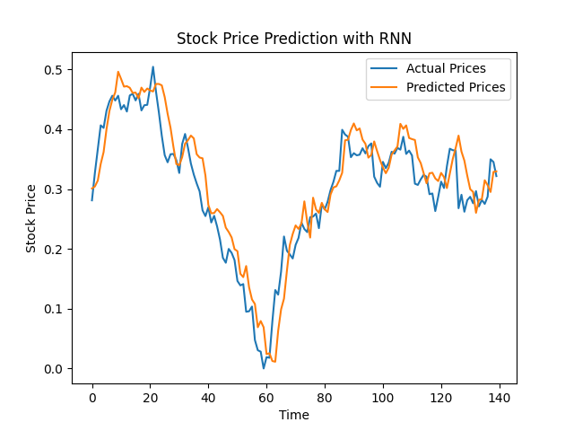
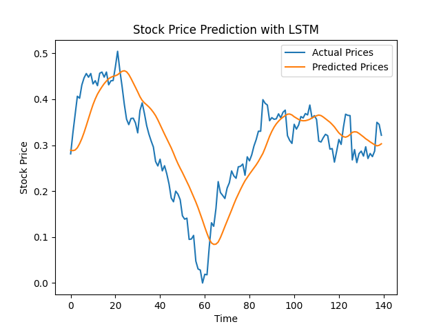
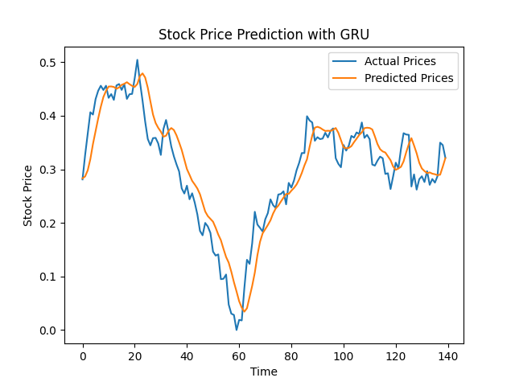
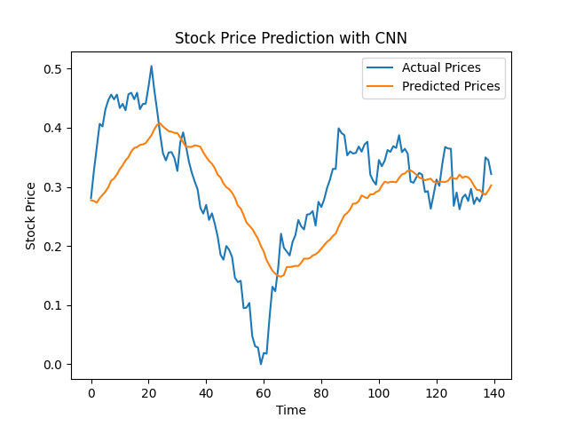

## **Stock Analysis**

### 🎯 **Goal**

The main goal of this project is to implement various machine learning models to predict stock prices based on historical data. The purpose is to evaluate which model provides the most accurate predictions for stock price movements.

### 🧵 **Dataset**

The dataset used for this project can be found [here](https://github.com/plotly/datasets/blob/master/tesla-stock-price.csv).

### 🧾 **Description**

This project explores the effectiveness of different neural network architectures in predicting stock prices. The models implemented include RNN, LSTM, GRU, and CNN, each chosen for their strengths in handling sequential data and capturing patterns over time.

### 🧮 **What I had done!**

- Preprocessed the dataset for training and testing.
- Implemented four different neural network models: RNN, LSTM, GRU, and CNN.
- Trained each model using the training dataset and evaluated their performance on the test dataset.
- Visualized the predicted prices against actual prices for each model.

### 🚀 **Models Implemented**

- **Recurrent Neural Network (RNN)**: Chosen for its ability to process sequences and capture dependencies.
- **Long Short-Term Memory Network (LSTM)**: Selected for its capability to handle long-term dependencies in the data.
- **Gated Recurrent Unit (GRU)**: Used due to its simpler architecture compared to LSTM while still retaining the ability to capture dependencies.
- **Convolutional Neural Network (CNN)**: Included for its effectiveness in detecting patterns in sequential data.

### 📚 **Libraries Needed**

- `numpy`
- `pandas`
- `matplotlib`
- `seaborn`
- `tensorflow`
- `sklearn`

### 📊 **Exploratory Data Analysis Results**

#### RNN Visualization

#### LSTM Visualization

#### GRU Visualization

#### CNN Visualization

### 📈 **Performance of the Models based on the Accuracy Scores**

- **RNN**: MSE score: 0.00173541318763599
- **LSTM**: MSE score: 0.004513041744798277
- **GRU**: MSE score: 0.0015398919282756725
- **CNN**: MSE score: 0.010369056334420581

### 📢 **Conclusion**

In conclusion, the GRU model provided the most accurate predictions with the lowest Mean Squared Error (MSE). While all models are capable of predicting stock prices, the GRU and RNN models excelled in capturing long-term dependencies effectively.

### ✒️ **Your Signature**

Surbhi Bahukhandi
