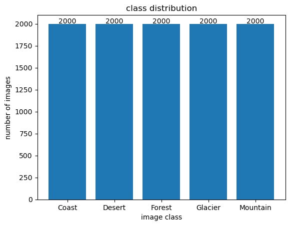
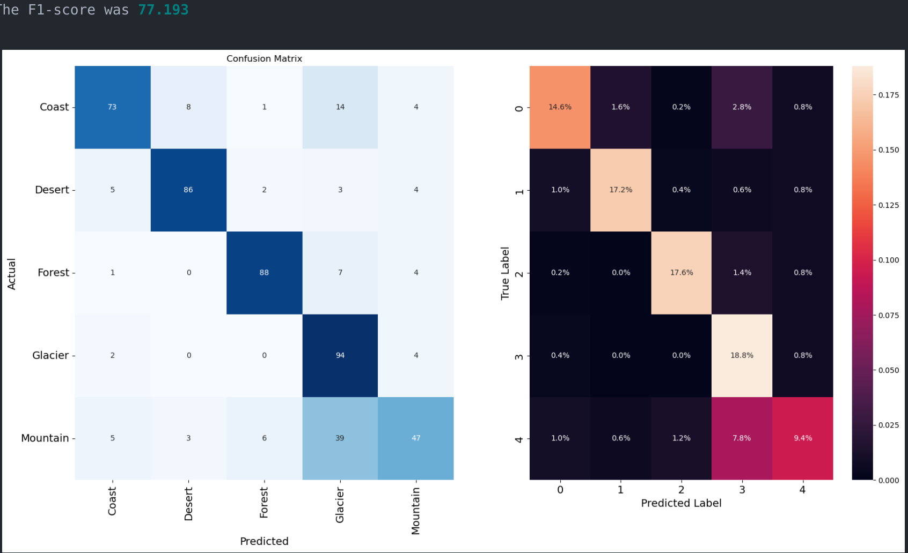
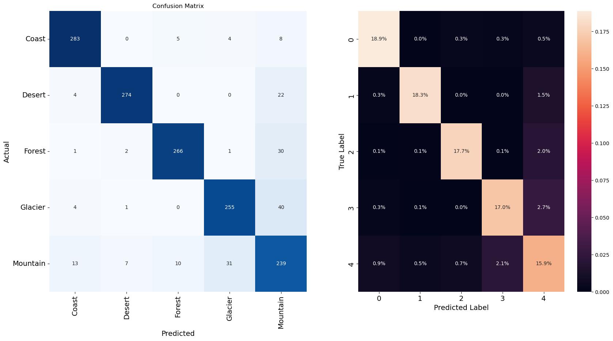
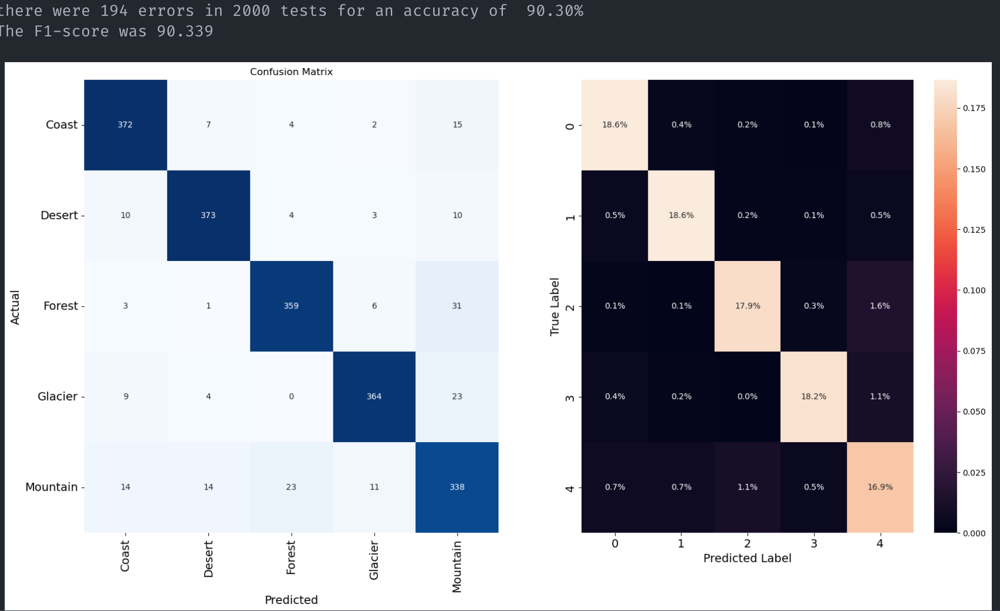
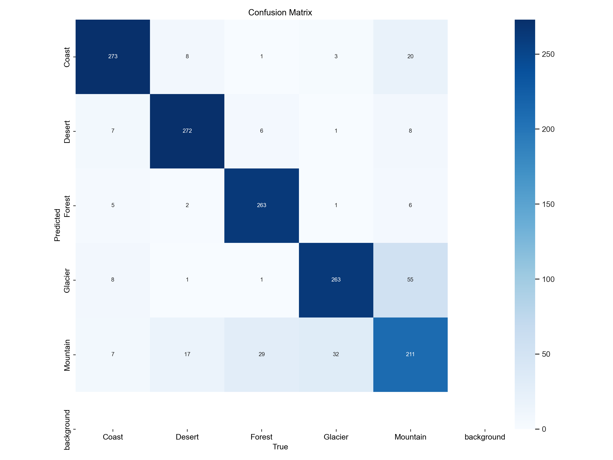

## **Terrain Classification**

### 🎯 **Goal**

This repo is dedicated for creating Terrain (Landscape) Classification using different Deep learning Neural network and comparing the performance(accuracy and throughput) and training efficiency of the Deep Neural Networks.

**Note:** All the models tested were S (the smallest) variant among the other larger variant of the same model

### 🧵 **Dataset**

The dataset for the model can be found [here](https://www.kaggle.com/datasets/utkarshsaxenadn/landscape-recognition-image-dataset-12k-images)

It consists of **12000** images. **10000** for Training and **2000** for validation. There are **5** Classes - **Coast, Desert, Forest, Glacier and Mountain** having **2000** Training images each. For Validation there are **300** images per class and for testing **100** images for each class.

### Dataset preparation:

 - Download the dataset from the above Url.

 - Extract  the Dataset from the zip file.

 - The dataset will be structured as follows:
    - Landscape Classification
      - Training Data
      - Validation Data
      - TFRecords
    - Testing Data

 - Rename the folders "Training Data" to "train" and "Validation Data" to "val" to meet [timm](https://github.com/huggingface/pytorch-image-models.git) library's Data loader standard.
 - Remove TFRecords Since we are not gonna be using Tensorflow.

### Dataset Augmentation:

The data will be Augmented which is best suited for a given architecture.

The following table briefly specify the Augmentation Strategies that were used

| Model Type | Augmentation used |
| ------------ | ----------------- |
| DeepViT    | Auto Augmentation (rand-m9-mstd0.5-inc1) |
| EfficientNetV3| Random Resized Crop, To Tensor, Random Horizontal Flip, Normalization - [0.485, 0.456, 0.406], [0.229, 0.224, 0.225] |
| DeiT3      | 3 Stage Augmentation - Gaussian blur, Monochrome Filter, Solarization |
| YoloV8     | Random Resized Crop, Color Jitter 0.5 , To Tensor, Random Horizontal Flip, Normalization - [0.485, 0.456, 0.406], [0.229, 0.224, 0.225] |

**Note:** For AutoAugmentation for Normalization the Mean and Std values are taken from ImageNet Default values.

### 🧾 **Description**

This projects makes of four Types of Neural Networks DeepViT, EfficientNet

### 🧮 **What I had done!**

I had implemented the respective network architectures using pytorch and timm library and some part of the code base from scratch (for deepViT). With the help of the custom data loader as well as that of timm's dataloader, the data has been augmented based on ImageNet's Normalization and Std. All the model uses the F1 Score for evaluating their performance.

### 🚀 **Models Implemented**

**➡** **DeepVit** - This Novel change in the  ViT architecture addresses the "attention collapse" phenomenon in Deep Vision Transformers (ViTs). Unlike convolutional neural networks (CNNs), which benefit from increased layers, ViTs' performance plateaus as they become deeper. This is due to attention maps becoming increasingly similar across layers, leading to ineffective representation learning. To address this, "Re-attention," a method that regenerates diverse attention maps across layers with minimal computational and memory overhead. This approach allows for deeper ViT models, improving Top-1 classification accuracy on ImageNet by 1.6% with 32 transformer blocks.

**Source:** [Arvix](https://arxiv.org/abs/2103.11886) [Github](https://github.com/zhoudaquan/dvit_repo.git)

**➡** **EfficientNet B3** - EfficientNets is a Novel CNN based Architecture which achieve much
better accuracy and efficiency than previous
ConvNets. In particular, our EfficientNet-B7
achieves state-of-the-art 84.3% top-1 accuracy
on ImageNet, while being 8.4x smaller and
6.1x faster. Here we use only EfficientNet B3 since it got 13 Million Parameter and is quite easier to train due to its superior finetuning efficiency compared to other to Neural Network architecture. It can be train at higher learning rates pretty easily like yolov8 since they all use convoluted networks

**Source:** [Arvix](https://arxiv.org/abs/1905.11946) [Github](https://github.com/huggingface/pytorch-image-models)

**➡** **DeiT 3 (Revenge of Vision Transformers)** - A improvement  Over DeiT (Data efficient Image Transformer). DeiT 3 incorporates novel training and finetuning strategies that significantly improve the training accuracy DeiT. DeiTs have remarkable training efficiency that  you can pretrain an entire model (86 Million Parameter) on a single computer in 3 days (used Nvidia A6000) on Imagenet-22K. It also use Teacher  student distillation techniques to create Distilled Models with high throughput. In DeiT 3 it introduces the concept of 3 Step Augmentation (Gaussian Blur, Grayscale and Solarization) for pretraining to help the model pick the minute details and nuance in the image data thus significantly accuracy upto 83.4% on ImageNet. 

**Source:** [Arvix](https://arxiv.org/abs/2204.07118) [Github](https://github.com/facebookresearch/deit/)

**➡** **YoloV8** - YOLOv8 is a powerful and versatile computer vision model for various tasks, making it a valuable tool for developers and researchers working on object recognition and related applications. Speed and It excels at real-time object detection, offering high accuracy while maintaining efficiency. YOLOv8 goes beyond just detection. It supports tasks like image classification, segmentation, pose estimation, and tracking.A user-friendly Python package and command-line interface make it accessible for various applications.Train YOLOv8 on your own datasets to tailor it to specific object recognition, classification needs. This is one of the most parameter efficient model that shows state of the art results.

**source:** [Github](https://github.com/ultralytics/ultralytics.git)

### 📚 **Libraries Needed**

The Libraries that were used is mostly around Pytorch. These include:

`torch torchvision timm rich numpy pandas pillow tqdm matplotlib scikit-learn seaborn`

### 📊 **Exploratory Data Analysis Results**

The dataset distribution chart:

**Confusion matrix for DeepViT:**

**Confusion Matrix for DeiT3:**

**Confusion Matrix for EfficientNet B3:**

**Confusion Matrix for YoloV8:**

### 📈 **Performance of the Models based on the Accuracy Scores**

Inside the Model Folder there will be a notebook where the code all the models' inference and evaluation. It also has the code 

 ## Performance Comparison:
 | Model type | Top 1 Accuracy | Top 5 Accuracy | Trained from scratch ? |
 | ---------- | -------------- | -------------- | ---------------------- |
 | DeepViT    | 77.60          | 99.4           | ✅                     |
 | EfficientNet B3| 90.03       | 99.7           | ❌                     |
 | DeiT 3     | 88.011         | 99.7          | ❌                     |
 | YoloV8     | 85.55          | 99.6           | ❌                     |

 All the model that are not trained from scratch are trained using transfer learning (Finetuned)

### 📢 **Conclusion**

EfficientNetV3 and DeiT3 achieved the highest top-1 accuracy (90.03 and 88.011%, respectively) followed by YoloV8 (85.55%). All models achieved very high top-5 accuracy (above 99%).
DeepViT, despite being trained from scratch, achieved a competitive top-1 accuracy (87.60%) compared to models using pre-trained weights (transfer learning).
EfficientNetV3 and DeiT3 benefited significantly from transfer learning, showcasing their potential for further improvement with more training data.
The choice of optimal model depends on the specific needs. EfficientNetV3 is a good balance between accuracy and trainability if computational resources are limited. DeiT3 might be preferred for its remarkable training efficiency, especially if large datasets are available. YoloV8 could be considered for its versatility beyond just classification tasks.

### ✒️ **Your Signature**

Created by: Mohana Krishna S
Email: www.mohanakrishna123@gmail.com
