# Traffic Sign Recognition

## 🎯 Goal
The main purpose of this project is to     **recognise traffic signs** from the dataset (mentioned below) using various image detection/recognition models and comparing their accuracy.

## 🧵 Dataset

The link to the dataset is given below :-

**Link :- https://www.kaggle.com/datasets/ahemateja19bec1025/traffic-sign-dataset-classification**

## 🧾 Description

This project involves the comparative analysis of three Keras image detection models, namely **VGG16** , **ResNet50** and **Xception**  applied to a specific dataset. The dataset consists of annotated images related to a particular domain, and the objectives include training and evaluating these models to compare their accuracy scores and performance metrics. Additionally, exploratory data analysis (EDA) techniques are employed to understand the dataset's characteristics, explore class distributions, detect imbalances, and identify areas for potential improvement. The methodology encompasses data preparation, model training, evaluation, comparative analysis of accuracy and performance metrics, and visualization of EDA insights. 

## 🧮 What I had done!

### 1. Data Loading and Preparation:
    Loaded the dataset containing image paths and corresponding labels into a pandas DataFrame for easy manipulation and analysis.

### 2. Exploratory Data Analysis (EDA):
    Bar Chart for Label Distribution: Created a bar chart to visualize the frequency distribution of different labels in the dataset.

    Pie Chart for Label Distribution: Generated a pie chart to represent the proportion of each label in the dataset.

### 3. Data Analysis:
    Counted the number of unique image paths to ensure data uniqueness and quality.
        Analyzed the distribution of image paths by label for the top 20 most frequent paths.
        Displayed the number of unique values for each categorical column to understand data variety.
        Visualized missing values in the dataset using a heatmap to identify and address potential data quality issues.
        Summarized and printed the counts of each label.

### 4.Cross-Tabulation:
    Created a cross-tabulation table to explore the relationship between image paths and labels.
       Plotted a heatmap to visualize the relationship between image paths and labels.

### 5. Image Preprocessing and Model Training:
    Loaded and preprocessed the test images, ensuring normalization of pixel values for consistency.
        Iterated through multiple models (VGG16, ResNet50 , Xception) saved in a directory and made predictions on the test dataset.
        Saved the predictions to CSV files for further analysis and comparison.

### 6. Model Prediction Visualization:
    Loaded models and visualized their predictions on a sample set of test images to qualitatively assess model performance.
        Adjusted image preprocessing for models requiring specific input sizes (e.g., 299x299 for Xception).

## 🚀 Models Implemented

Trained the dataset on various models , each of their summary is as follows :-

### Xception

When implementing the Xception model in code, we leverage its sophisticated architecture to bolster our image classification tasks. By loading the pre-trained Xception model with weights from the ImageNet dataset, we harness its comprehensive knowledge.

**Reasons for choosing Xception:** :  Lightweight (88 MB) , 
**Excellent Accuracy** (Xception achieves high accuracy in image classification tasks .) , 
Reduced Parameters (22.9M) ,
Faster Inference Speed (CPU - 39.4, GPU - 5.2)

Visualization of Predicted Labels on test set :-

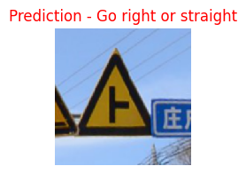
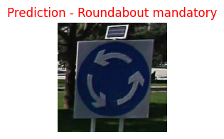
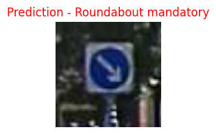

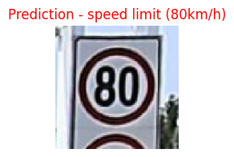

### VGG16
I will utilize the VGG16 (Visual Geometry Group) architecture, which have deeper and complex structures. These models are renowned for their exceptional performance on various image recognition tasks. 

**Reason for choosing :-** 
 Highest accuracy (90.1%) , less depth (16) , inference speed less when using GPU (CPU - 69.5 , GPU - 4.2)

Visualization of Predicted Labels on test set :-

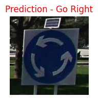
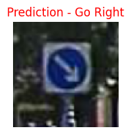

### ResNet50
Employing transfer learning with the ResNet50 model enables us to exploit pre-trained weights, significantly reducing the training time required for image classification tasks. This approach is particularly advantageous when dealing with limited training data, as we can leverage the rich representations learned by the base model from a vast dataset like ImageNet.

**Reason for choosing :-** 
 Relatively lightweight (98 MB) , High Accuracy (92.1 % Top 5 accuracy), Moderate Parameters (25.6M) , Reasonable Inference Speed on GPU (CPU - 32.1, GPU - 4.7)

Visualization of Predicted Labels on test set :-
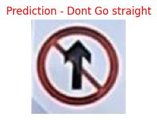  
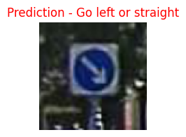  
  
  
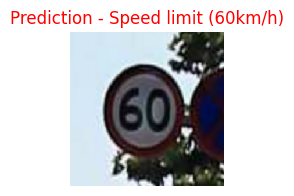  

## 📚 Libraries Needed

1. **NumPy:** Fundamental package for numerical computing.
2. **pandas:** Data analysis and manipulation library.
3. **scikit-learn:** Machine learning library for classification, regression, and clustering.
4.  **Matplotlib:** Plotting library for creating visualizations.
5.  **Keras:** High-level neural networks API, typically used with TensorFlow backend.
6. **tqdm:** Progress bar utility for tracking iterations.
7. **seaborn:** Statistical data visualization library based on Matplotlib.

## 📊 Exploratory Data Analysis Results

### Bar Chart :-
 A bar chart showing the distribution of labels in the training dataset. It visually represents the frequency of each label category, providing an overview of how the labels are distributed across the dataset.

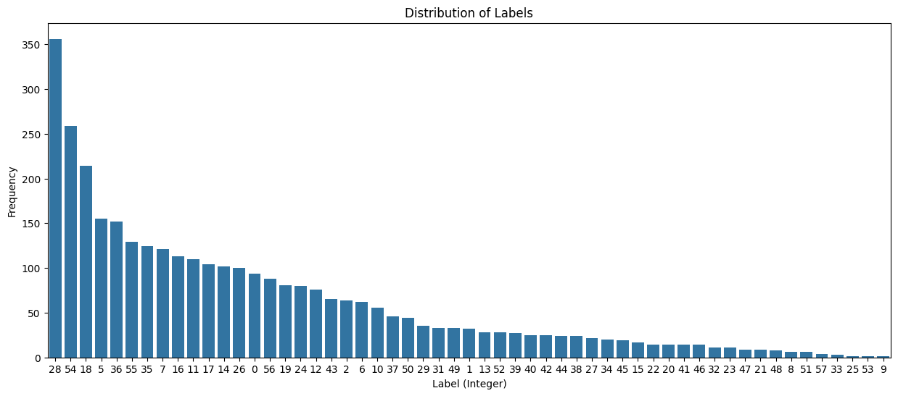

### Pie Chart :-
A pie chart illustrating the distribution of labels in the training dataset. The percentage value displayed on each segment indicates the relative frequency of each label category.

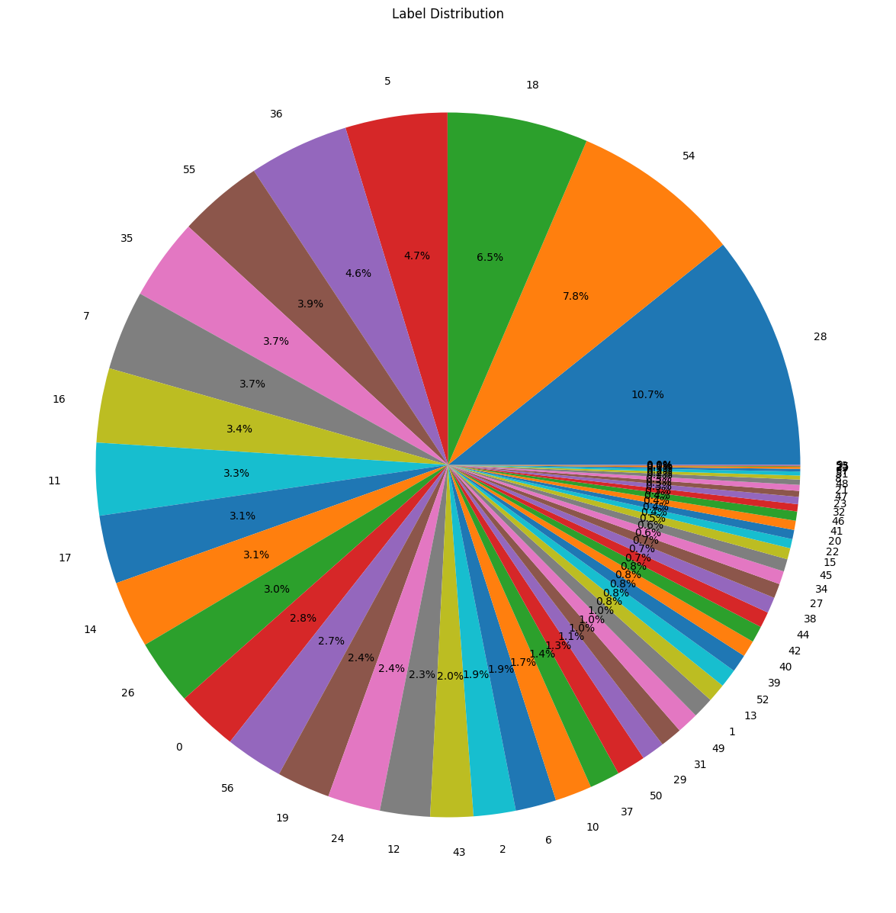

### Image paths distribution :-
 Visualizes the distribution of top 20 image paths by label, displays unique values in categorical columns

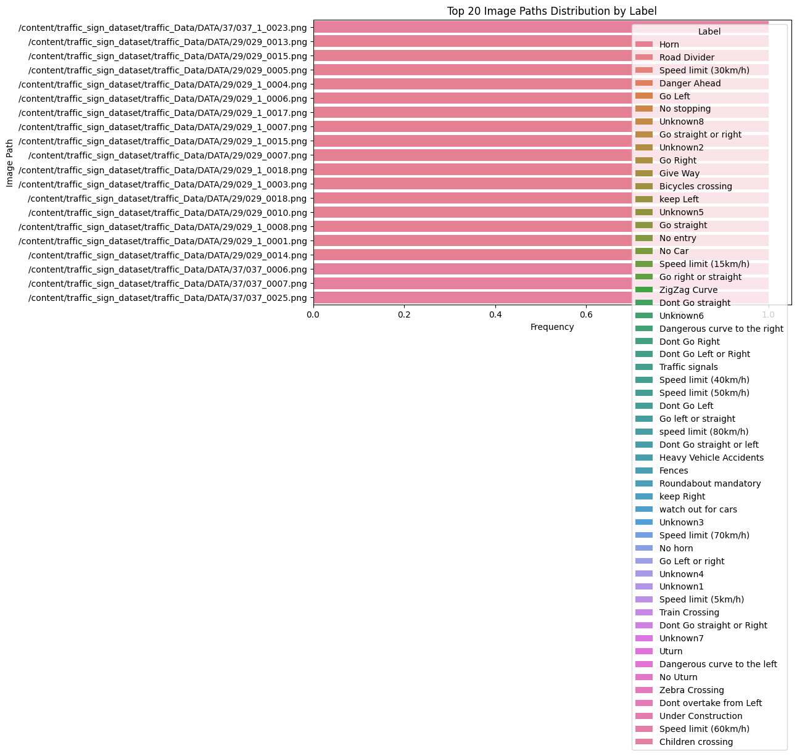

### Cross-tabulation :-
a cross-tabulation table that shows the relationship between image paths and labels in the dataset. The heatmap visualization highlights the distribution of labels across different image paths, providing insights into the labeling patterns within the dataset.

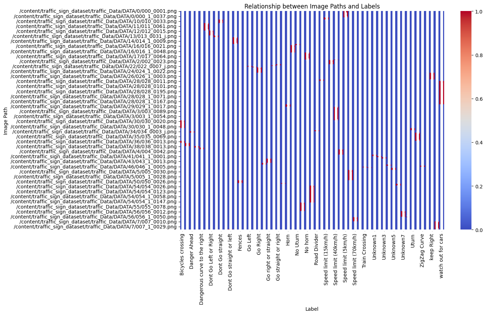

## 📈 Performance of the Models based on the Accuracy Scores

| Models      |       Accuracy Scores|
|------------ |------------|
|Xception  |99% ( Validation Accuracy: 0.9907)|
|ResNet50  | 97% (Validation Accuracy: 0.9720) |
|VGG16        | 88% (Validation Accuracy: 0.8833) |

## 📢 Conclusion

**Accoding to the accuracy scores it can be concluded that Xception and ResNet50 were able to perform good on this dataset.**

 Even though on data analysis we found that the distribution of the dataset isn't consistent for all the classes.

## ✒️ Your Signature

Full name:- AaradhyaSingh                      
Github Id :- https://github.com/kyra-09  
Email ID :- aaradhyasinghgaur@gmail.com  
Participant Role :- Contributor / GSSOC (Girl Script Summer of Code ) - 2024
