# Urdu Text Detection

## Aim
Create DL model which will identify the texts written in Urdu.

## Dataset
https://www.kaggle.com/datasets/maryambiibii/urdu-artificial-text-text-detection

## Mindset
This model can be created effectively using r-CNN, faster r-CNN, EAST or YOLO models without the need for creating our own. But here we've created a custom model from scratch using tensorflow and keras.

## Libraries and Frameworks used
* `Numpy` - for array manipulations and calculations
* `Pandas` - for dealing with dataframe and training and test sets.
* `Matplotlib` - for plotting graphs and images
* `cv2` (OpenCV) - for manipulating images
* `Pillow` - for viewing images
* `tensorflow` & `keras` - for implementing Deep Learning Models

## Procedure

### Training Data
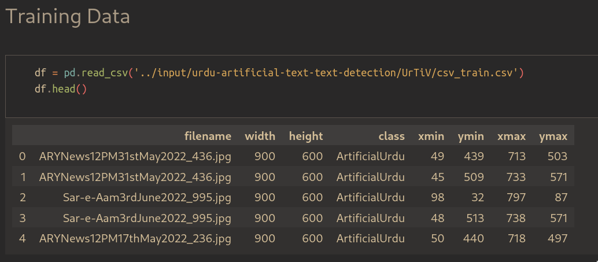

### Testing Data
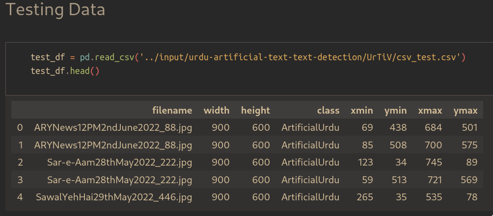

### Aggregated Data
Here, every box has its own single entry in the dataframe. In order to feed the data to our algorithm we need to associate all the boxes that belong to a single image in one row.

So, we created a function which combines all the boxes in a single image in one row.

So, this is our reduced dataframe.

### Creating Training and Test set
Training and Test set are created in following way:

|Image_arr|bounding_boxes|
|---------|--------------|
|array([...])|array([...])|

We have multiple image array as input which will be fed to our model and then bounding boxes which our model will output.

### Model Creation
Following is our CNN architecture used.
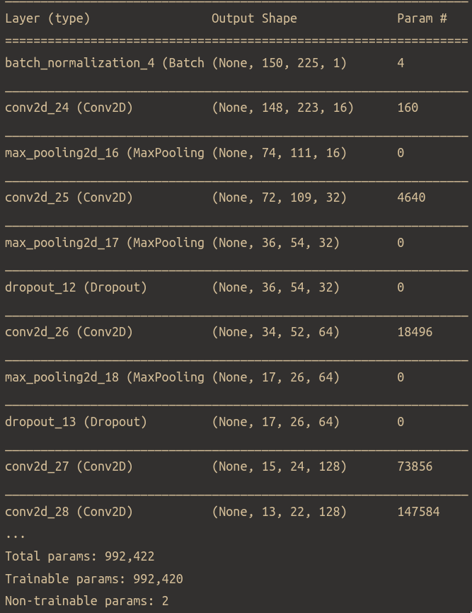

We used **Dropout** for preventing overfitting of data and **BatchNormalization** to scale down the parameters.

### Performance Measure of different Optimizers
Here we've tested our mode with various optimizers
|Optimizer|Accuracy|Loss|
|---------|--------|----|
|Adadelta|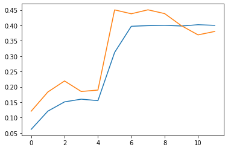|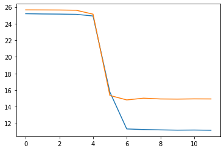|
|Adagrad|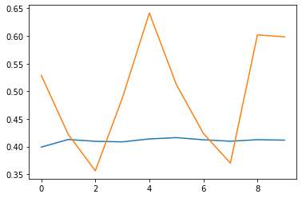|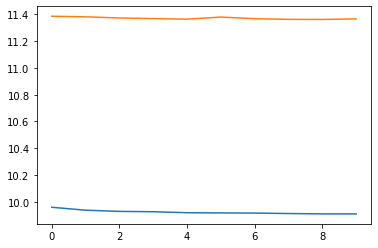|
|Adam|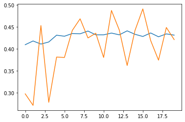|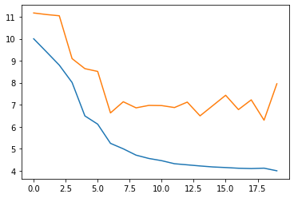|
|SGD|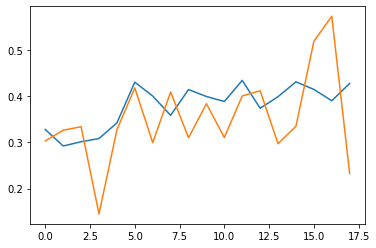|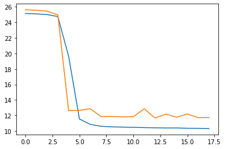|

### Output_samples
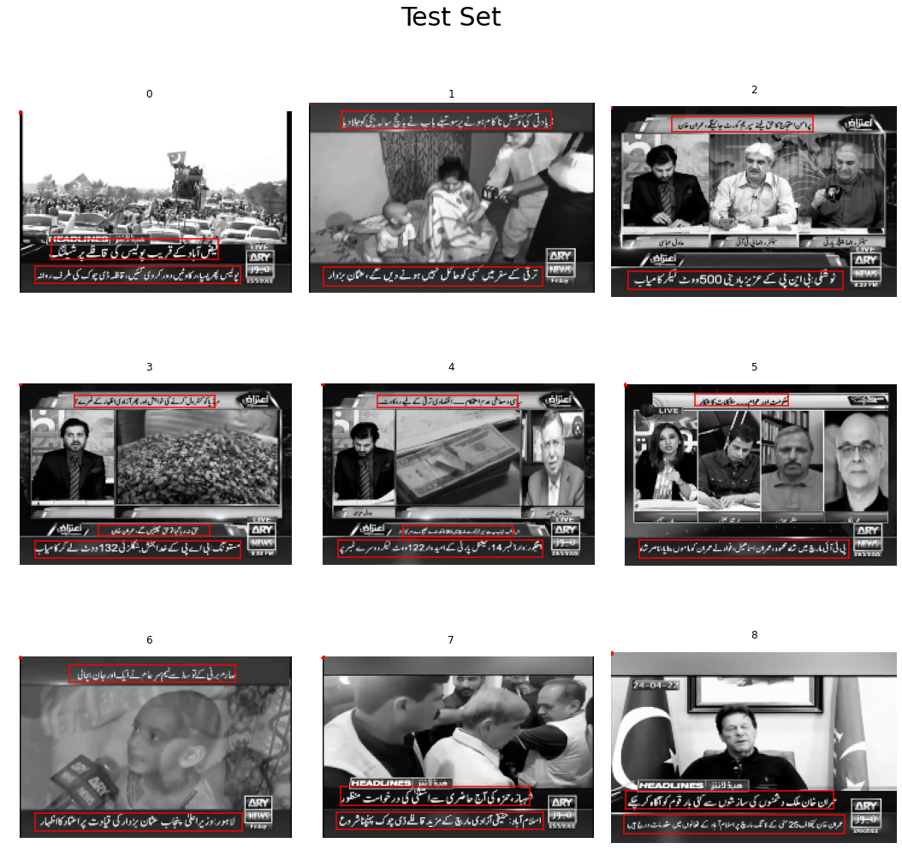

### Conclusion
We successfully tested out different optimizer functions on models and have measured their accuracy and loss.

Output Sample verifies that our model is performing descent on different images and is successful in detecting Urdu text in various images.

## Connect With Me
* [Linkedin](www.linkedin.com/in/abhishak3)
* [Twitter](www.twitter.com/abhi_shak3)
* [Github](www.github.com/abhishak3)