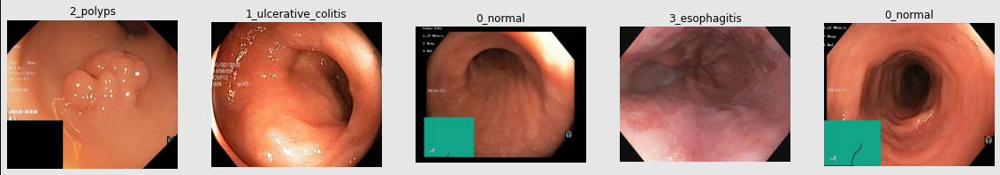
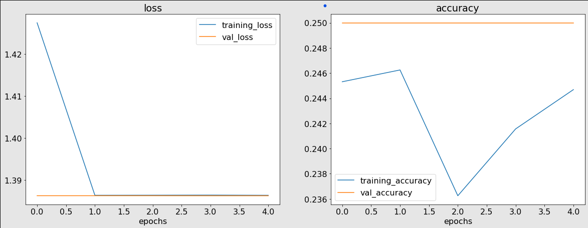
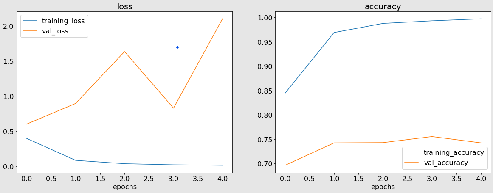
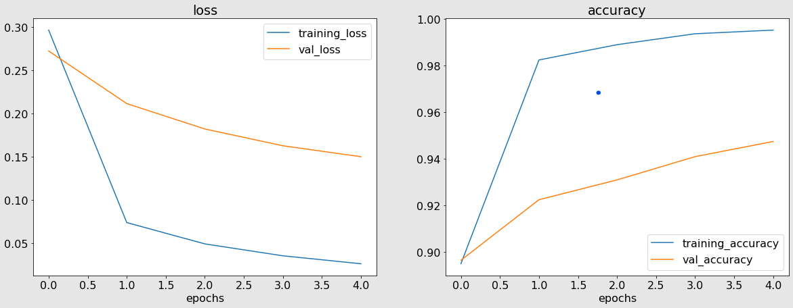
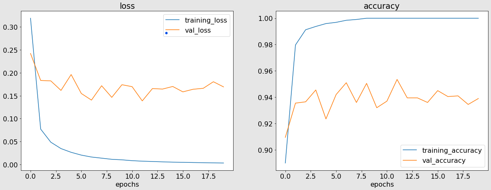

# WCE Curated Colon Disease Detection

**GOAL**

To classify the images from the WCE Curated Colon Disease dataset using a Deep Learning approach.

**DATASET**

https://www.kaggle.com/datasets/francismon/curated-colon-dataset-for-deep-learning

**DESCRIPTION**

The dataset contains images of 4 different classes of colon diseases. There are 1500 images of each type. The task is to classify the images by using a deep learning architecture.

**WHAT I HAD DONE**

First I imported all the required libraries and dataset for this project. Then I imported the dataset and split it into training, validation and testing sets in the ratio 70:20:10. Then I proceeded to build the model. 

I have developed 5 deep learning models to classify the images. First I used a ANN to classify the images. But I didn't get a good accuracy. Secondly I used a CNN to classify the images, but the model wasn't performing well. Lastly, I used a CNN with MaxPooling layers but I didn't get a satisfactory accuracy score. 

Then I proceeded with Transfer Learning. I used the [ResNet 50](https://tfhub.dev/google/imagenet/resnet_v2_50/feature_vector/5) model and trained this model on the images from the dataset. I first got some improvements in the accuracy, but after training the model for more epochs I got an accuracy score of 94.49

**MODELS USED**

The models are:

1. Artificial Neural Network (ANN)
2. Convolutional Neural Network (CNN)
3. Convolutional Neural Network (CNN) with MaxPooling layer
4. Transfer Learning Model (ResNet) 5 epochs
5. Transfer Learning Model (ResNet) 20 epochs

**LIBRARIES NEEDED**

* kaggle
* tensorflow
* split-folders
* matplotlib

**VISUALIZATION**

### Images of different Rice classes

### Model 1 (ANN Model) performance graphs

### Model 2 (Basic CNN Model) performance graphs

By viewing the graphs, we can conclude that the model is not performing well. It is overfitting on the training data.

### Model 3 (CNN Model with MaxPooling layer) performance graphs

By adding the MaxPooling layer, the model is now performing better than before.

### Model 4 (Transfer Learning Model (ResNet) 5 epochs) performance graphs

### Model 5 (Transfer Learning Model (ResNet) 20 epochs) performance graphs

### Prediction

Prediction on a random image from the testing dataset.

**ACCURACIES**

| Model         | Architecture              | Accuracy in % (on testing data) |
| ------------- |:-------------------------:|:-------------:|
| Model 1       | ANN Model                 |25.00          |
| Model 2       | Basic CNN Model           |77.49          |
| Model 3       | CNN Model with MaxPooling |74.25          |
| Model 4       | Transfer Learning Model (ResNet) 5 epochs |93.99          |
| Model 5       | Transfer Learning Model (ResNet) 20 epochs |94.49          |

**CONCLUSION**

I was successfully able to develop a Deep Learning model that can classify images from the given WCE Curated Colon Disease dataset.

**Omkar Jahagirdar**

Connect with me on Linkedin: https://www.linkedin.com/in/omkar-jahagirdar/

Check out my Github profile: https://github.com/omkar3602
