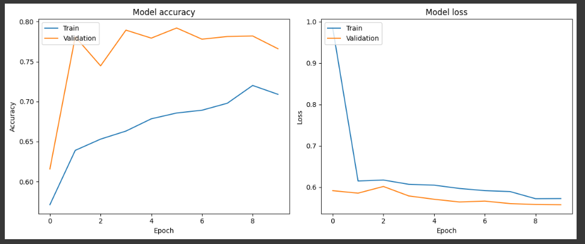
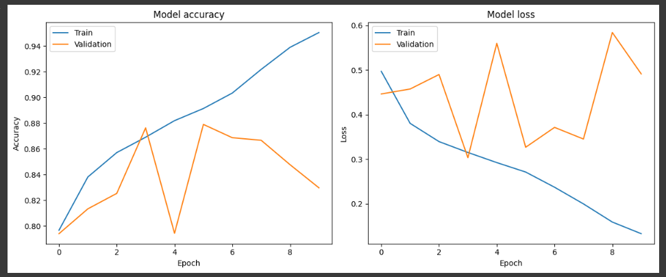
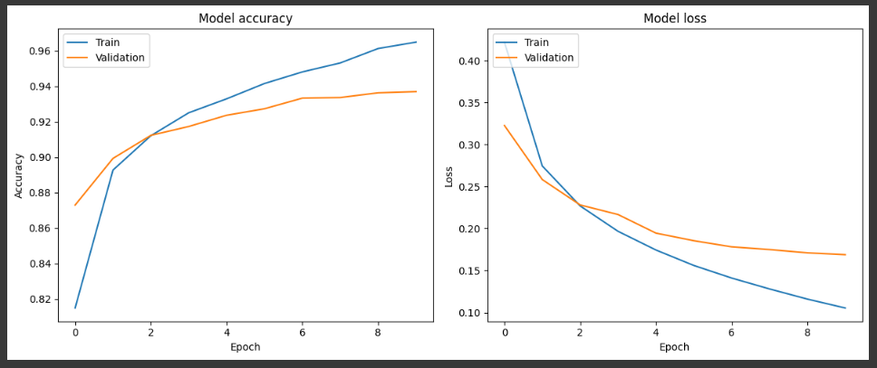
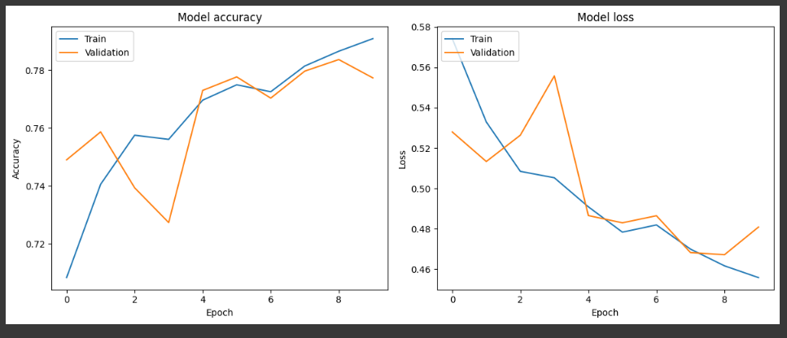
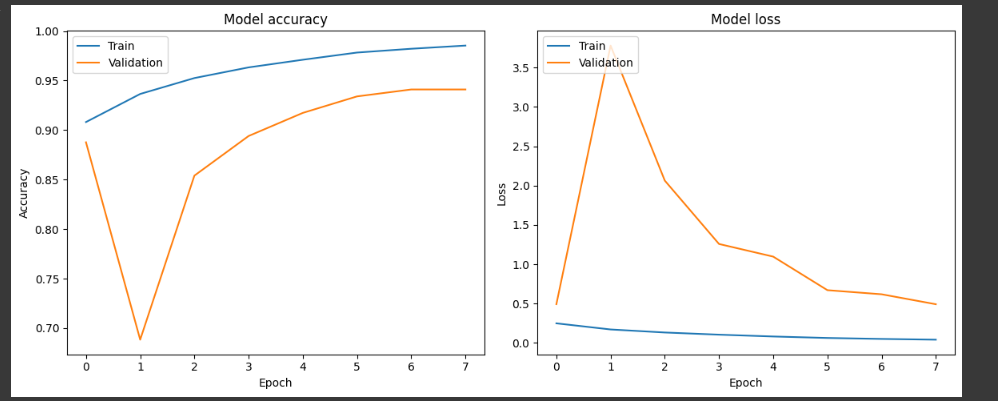

# Waste Classification Using Deep Learning

**GOAL**

To classify images from the waste classification dataset using a deep learning approach.

**DATASET**

[Waste Classification Data](https://www.kaggle.com/datasets/techsash/waste-classification-data)

**DESCRIPTION**

The dataset contains images of organic (O) and recyclable (R) waste. The task is to classify these images using deep learning architectures.

**WHAT I DID**

First, I imported all the required libraries and the dataset for this project. I split the dataset into training, validation, and testing sets. Then I proceeded to build and evaluate the models.

I developed several deep learning models to classify the images. Initially, I used an Artificial Neural Network (ANN), followed by a Convolutional Neural Network (CNN). Both models did not yield satisfactory accuracy. I then used VGG16, ResNet, and MobileNetV2 architectures, with the latter providing better performance. Finally, I evaluated the performance of all the models in order to pick the optimal model.

**MODELS USED**

The models are:

1. Artificial Neural Network (ANN)
2. Basic Convolutional Neural Network (CNN)
3. VGG16 Model
4. ResNet Model
5. MobileNetV2 Model

**LIBRARIES NEEDED**

- tensorflow
- matplotlib
- opencv-python
- numpy
- random
- shutil

**VISUALIZATION**

### Model 1 (ANN Model) Performance Graphs

### Model 2 (Basic CNN Model) Performance Graphs

### Model 3 (VGG16 Model) Performance Graphs

### Model 4 (ResNet Model) Performance Graphs

### Model 5 (MobileNetV2 Model) Performance Graphs

**ACCURACIES**

| Model              | Architecture                | Accuracy in % (on testing data) |
|--------------------|:---------------------------:|:------------------------------:|
| Model 1            | ANN Model                   | 81.73                          |
| Model 2            | Basic CNN Model             | 87.31                          |
| Model 3            | VGG16 Model                 | 90.65                          |
| Model 4            | ResNet Model                | 76.88                          |
| Model 5            | MobileNetV2 Model           | 90.85                          |

**CONCLUSION**

After training and evaluating various deep learning models on the waste classification dataset, the results are as follows:

**Key Observations:**

1. **Artificial Neural Network (ANN) Model**: Achieved an accuracy of 81.73%. While it provided a decent baseline, it was outperformed by the other convolutional neural network-based models.

2. **Basic CNN Model**: Improved accuracy significantly to 87.31%, demonstrating the power of convolutional layers in image classification tasks.

3. **VGG16 Model**: Achieved an impressive accuracy of 90.65%. This pre-trained model showed strong performance, indicating the benefits of transfer learning.

4. **ResNet Model**: Obtained an accuracy of 76.88%, which was lower than expected. This might be due to overfitting or insufficient fine-tuning.

5. **MobileNetV2 Model**: Achieved the highest accuracy of 90.85%. This lightweight model is particularly suitable for deployment in resource-constrained environments.

**Conclusion:**

The MobileNetV2 model emerged as the best-performing model for the waste classification task, with an accuracy of 90.85%. Its balance of high accuracy and computational efficiency makes it an excellent choice for practical applications. The VGG16 model also performed very well and could be a suitable alternative depending on the specific use case requirements.

Further improvements can be made by fine-tuning the models, exploring additional data augmentation techniques, and experimenting with different hyperparameters.

**Connect with Me**

- [LinkedIn](https://www.linkedin.com/in/barrenkala-veera-venkata-karthik-b58b9a285/)
- [GitHub](https://github.com/Karthik110505)
