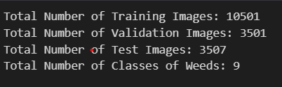
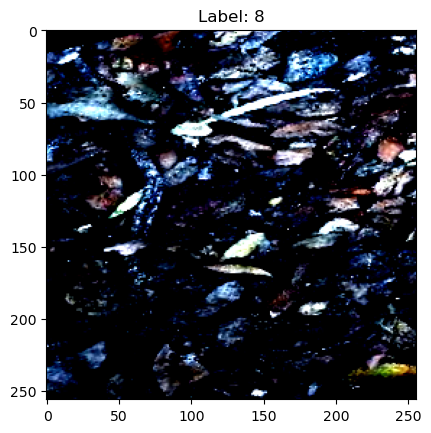

# Weed Classification using DL 

## PROJECT TITLE

Weed Detection using Deep Learning 

## GOAL

To identify the weed image. 

## DATASET

The link for the dataset used in this project:  https://www.kaggle.com/datasets/imsparsh/deepweeds
It has 9 classes of Classification

## EDA:

## DESCRIPTION

This project aims to identify the weed name using Deep Learning.

## WHAT I HAD DONE

1. Data collection: From the link of the dataset given above using TensorflowDataset. 
2. Data preprocessing: Preprocessed the image according to the requirement of the model.
3. Model selection: Densenet and Mobilnet V2 with a added Dense Classification Layer
4. Comparative analysis: Compared the accuracy score of all the models.

## MODELS SUMMARY

Model: "model" Densenet
__________________________________________________________________________________________________
 Layer (type)                   Output Shape         Param #     Connected to                     
==================================================================================================
 input_1 (InputLayer)           [(None, 224, 224, 3  0           []                               
                                )]                                                                
                                                                                                  
 zero_padding2d (ZeroPadding2D)  (None, 230, 230, 3)  0          ['input_1[0][0]']                
                                                                                                  
 conv1/conv (Conv2D)            (None, 112, 112, 64  9408        ['zero_padding2d[0][0]']         
                                )                                                                 
                                                                                                  
 conv1/bn (BatchNormalization)  (None, 112, 112, 64  256         ['conv1/conv[0][0]']             
                                )                                                                 
                                                                                                  
 conv1/relu (Activation)        (None, 112, 112, 64  0           ['conv1/bn[0][0]']               
                                )                                                                 
                                                                                                  
 zero_padding2d_1 (ZeroPadding2  (None, 114, 114, 64  0          ['conv1/relu[0][0]']             
 D)                             )                                                                 
                                                                                                  
 pool1 (MaxPooling2D)           (None, 56, 56, 64)   0           ['zero_padding2d_1[0][0]']       
                                                                                                  
 conv2_block1_0_bn (BatchNormal  (None, 56, 56, 64)  256         ['pool1[0][0]']                  
 ization)                                                                                         
...
Total params: 7,333,961
Trainable params: 380,105
Non-trainable params: 6,953,856

Model: "sequential_1" Mobilenet
_________________________________________________________________
 Layer (type)                Output Shape              Param #   
=================================================================
 mobilenetv2_1.00_224 (Funct  (None, 8, 8, 1280)       2257984   
 ional)                                                          
                                                                 
 global_average_pooling2d (G  (None, 1280)             0         
 lobalAveragePooling2D)                                          
                                                                 
 dense_3 (Dense)             (None, 256)               327936    
                                                                 
 dropout_1 (Dropout)         (None, 256)               0         
                                                                 
 dense_4 (Dense)             (None, 9)                 2313      
                                                                 
=================================================================
Total params: 2,588,233
Trainable params: 330,249
Non-trainable params: 2,257,984
_________________________________________________________________

## LIBRARIES NEEDED

The following libraries are required to run this project:

- matplotlib
- tensorflow
- keras
- PIL

## EVALUATION METRICS

The evaluation metrics I used to assess the models:

- Accuracy 
- Loss
- Confusion Matrix

It is shown using Confusion Matrix in the Images folder

## RESULTS
Results on Val dataset:
For Mobilnet:
Accuracy:83%
loss: 0.47

For Model-2:
Accuracy:70%
loss: 0.82

## CONCLUSION
Based on results we can draw following conclusions:

1.The densenet model worked better than the mobilenet model