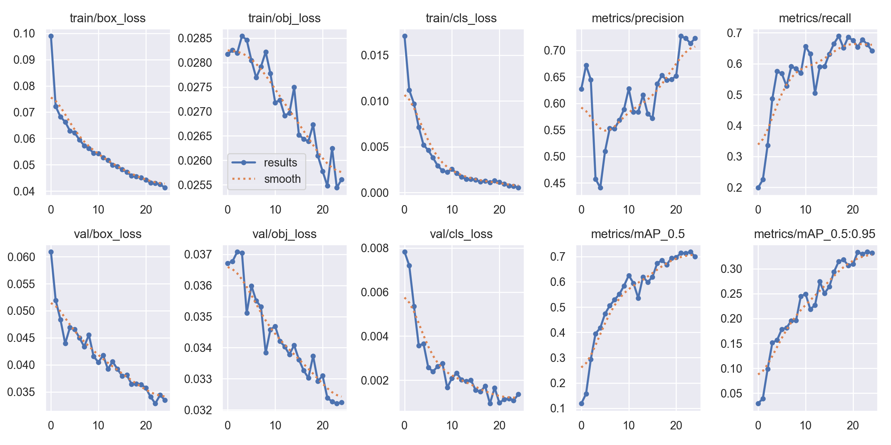
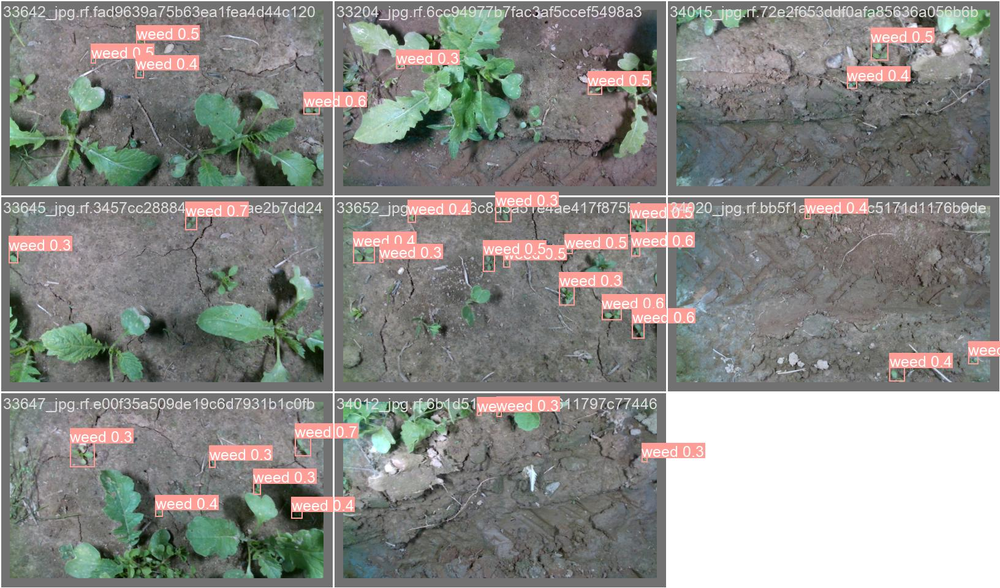

# WeedCrop Detection using YOLO

Identifying weeds and distinguish them from crops is very essential in Farming.
The project aims to differentiate and identify crops from weeds. For this detection, I'm employing a few State of the Art (SOTA) architectures based on the "You only look once" (YOLO) approach. This project is submitted to the DL-Simplified project as a part of Social Winter of Code (SWOC).

## How to install requirements

```
pip install -r requirements.txt

```

## About Dataset

The dataset used here is provided at https://www.kaggle.com/datasets/vinayakshanawad/weedcrop-image-dataset/data.

It includes 2822 images.
Weed are annotated in YOLO v5 PyTorch format.

<b>The following pre-processing was applied to each image:-</b>
Auto-orientation of pixel data (with EXIF-orientation stripping)

<b>The following augmentation was applied to create 3 versions of each source image:-</b>
Equal probability of one of the following 90-degree rotations: none, clockwise, counter-clockwise
Random shear of between -15° to +15° horizontally and -15° to +15° vertically
Random brigthness adjustment of between -25 and +25 percent<br>
Classes
Crop, Weed

## The Model

So the model I have used here is YOLO V5s, YOLO V8s

### How YOLO works

Compared to the approach taken by object detection algorithms before YOLO, which repurpose classifiers to perform detection, YOLO proposes the use of an end-to-end neural network that makes predictions of bounding boxes and class probabilities all at once.

Following a fundamentally different approach to object detection, YOLO achieves state-of-the-art results beating other real-time object detection algorithms by a large margin.

<center>


Source:Google

</center>

## Training and Testing of the Models

The results along with their training and validation time and epoches are given below:

| Models  | mAP@.5 | mAP@.5:.95: | Precision | Recall | Computation-Time | Number of Epochs |
| ------- | ------ | ----------- | --------- | ------ | ---------------- | ---------------- |
| YOLOv5s | 0.699  | 0.331       | 0.722     | 0.641  | 45min 7s         | 25               |
| YOLOv8s | 0.625  | 0.310       | 0.597     | 0.689  | 90min 33s        | 25               |

### Explanation of the parameters of Yolo:

<ul>
<li><u>Average Precision (AP)</u></li>

Average Precision is calculated as the area under a precision vs recall curve for a set of predictions.

<li><u>Recall</u></li>

Recall is calculated as the ratio of the total predictions made by the model under a class with a total of existing labels for the class.

<li><u>Precision</u></li>
On the other hand, Precision refers to the ratio of true positives with respect to the total predictions made by the model.

<li><u>mean Average Precision (mAP)</u></li>
The area under the precision vs recall curve gives us the Average Precision per class for the model. The average of this value, taken over all classes, is termed as mean Average Precision (mAP).
</ul>

### Results of Training of the models

Below are the results of the training of Yolo v5s and YOLO v8s:

<center>
 Yolo v5s

<br><br><br>
Yolo v8s


</center>

## Conclusion

So since the mAP@0.5 and mAP@0.5-0.95 of YOLOv5s is best(0.699, 0.331), so it comes out to be the best model for WeedCrop Detection. Some same predictions made by this model can be shown below:

### YOLOv5:



## Methods and sources Used:

- DeepLearning.AI:- Convolutional Neural networks
  (https://www.coursera.org/learn/convolutional-neural-networks?specialization=deep-learning)
- YOLOv8 Tutorial
  (https://www.youtube.com/watch?v=iy34dSwfEsY&ab_channel=DSwithBappy)

- https://github.com/ultralytics/yolov5 (The github repo is imported in the model)

## Developer Details

Developed By Aryan Kashyap
(Artificial Intelligence and Data Science, VIT Pune)
