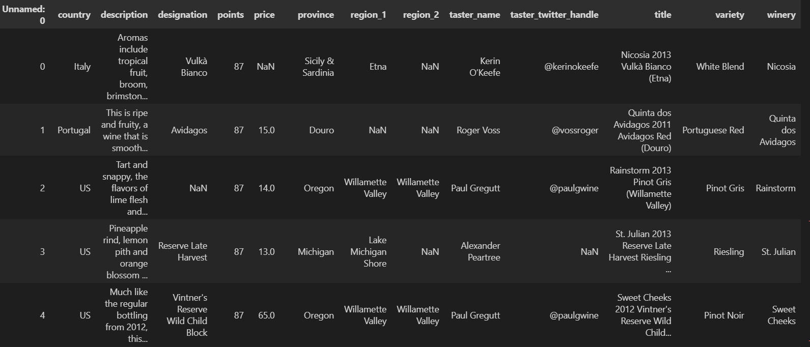
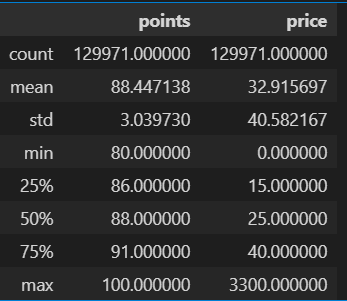

# Wine Reviews Classification using DL 

## PROJECT TITLE

Wine Reviews Classification using Deep Learning 

## GOAL

To classify the quality of wine based on reviews. 

## DATASET

The link for the dataset used in this project:  https://www.kaggle.com/datasets/zynicide/wine-reviews 

## EDA
Shape of Dataset:(129971, 14)

## DESCRIPTION

This project aims to identify the quality points of wine based upon its reviews.

## WHAT I HAD DONE

1. Data collection: From the link of the dataset given above. 
2. Data preprocessing: Preprocessed the news by combining title and text to create a new feature and did some augementation like tokeinizing and vectorising before passing them to model training
3. Model selection: Self Designed model having a Embedding Layer followed by Global Pooling Layer and then 2 Dense layers and then output layer.Second model had a Embedding layer followed by a RNN layer and a Dense output layer.
4. Comparative analysis: Compared the accuracy score of all the models.

## MODELS SUMMARY

Model: "sequential"
_________________________________________________________________
 Layer (type)                Output Shape              Param #   
=================================================================
 embedding (Embedding)       (None, 89, 200)           12794200  
                                                                 
 global_average_pooling1d (  (None, 200)               0         
 GlobalAveragePooling1D)                                         
                                                                 
 dense (Dense)               (None, 100)               20100     
                                                                 
 dense_1 (Dense)             (None, 50)                5050      
                                                                 
 dense_2 (Dense)             (None, 21)                1071      
                                                                 
=================================================================
Total params: 12820421 (48.91 MB)
Trainable params: 12820421 (48.91 MB)
Non-trainable params: 0 (0.00 Byte)

Model-2: "sequential_1"
_________________________________________________________________
 Layer (type)                Output Shape              Param #   
=================================================================
 embedding_1 (Embedding)     (None, 89, 100)           6397100   
                                                                 
 simple_rnn (SimpleRNN)      (None, 30)                3930      
                                                                 
 dense_3 (Dense)             (None, 21)                651       
                                                                 
=================================================================
Total params: 6401681 (24.42 MB)
Trainable params: 6401681 (24.42 MB)
Non-trainable params: 0 (0.00 Byte)

## LIBRARIES NEEDED

The following libraries are required to run this project:

- nltk
- pandas
- matplotlib
- tensorflow
- keras
- sklearn

## EVALUATION METRICS

The evaluation metrics I used to assess the models:

- Loss 
- Accuracy

It is shown using Confusion Matrix in the Images folder

## RESULTS
Results on Val dataset:
For Model-1:
Accuracy:31%
loss: 3.1

For Model-2:
Accuracy:9%
loss:8.05

## CONCLUSION
Based on results we can draw following conclusions:

1.The model-1 performed better than model 2.