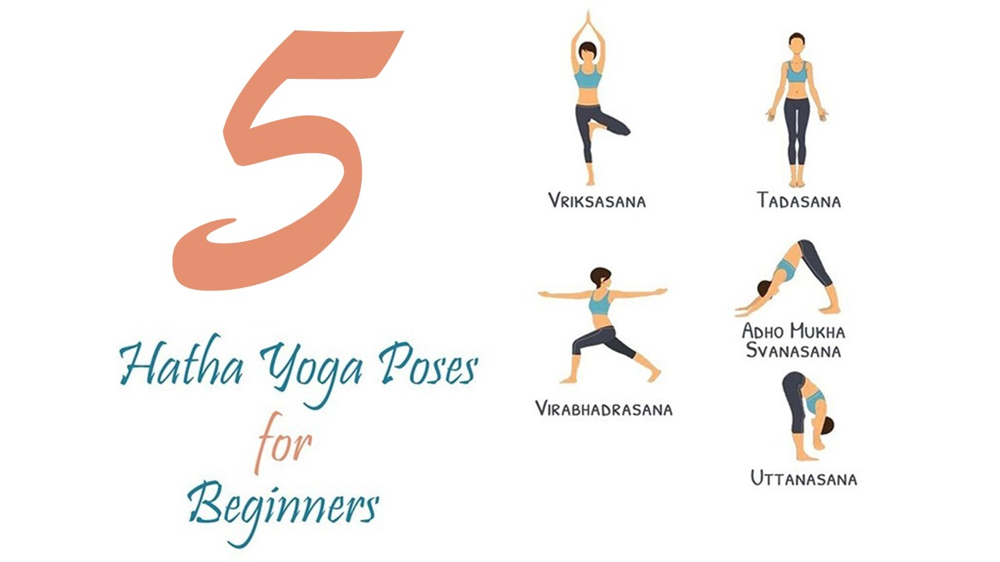

## Data Set

The data set which I have provided has the ability to detect 5 yogasana's as follows:

The best part of the model is that , it allows you to train your own yogasana's throught the webcam as well by just calling the [addfunction]().