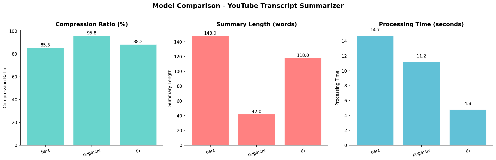
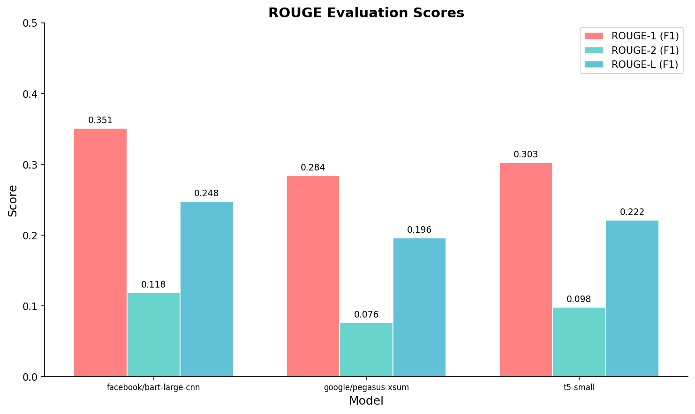
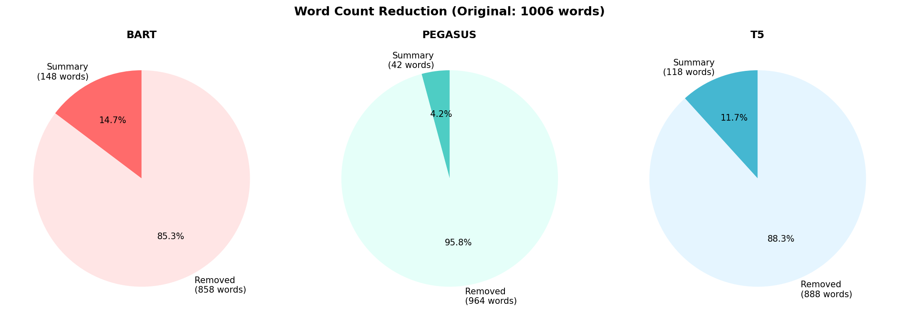

## **YouTube Transcript Summarizer using NLP**

### 🎯 **Goal**

To provide concise, meaningful summaries of YouTube video transcripts using Natural Language Processing (NLP), reducing transcript length by ~80% while retaining key information — enabling users to quickly grasp the core message of a video without watching the entire content.

### 🧵 **Dataset**

This project **does not use a static dataset**. Instead, it dynamically extracts transcripts from YouTube videos in real-time using the [`youtube-transcript-api`](https://pypi.org/project/youtube-transcript-api/) Python library.

**Sample videos used for testing:**
| Video | Topic | Duration | Transcript Length |
|-------|-------|----------|-------------------|
| [TED Talk - Inside the Mind of a Master Procrastinator](https://www.youtube.com/watch?v=arj7oStGLkU) | Psychology | ~14 min | ~2000 words |
| [3Blue1Brown - Neural Networks](https://www.youtube.com/watch?v=aircAruvnKk) | Deep Learning | ~19 min | ~3500 words |
| [Fireship - 100 Seconds of Code](https://www.youtube.com/watch?v=dc-2t26Vuhs) | Programming | ~2 min | ~300 words |

### 🧾 **Description**

This project extracts transcripts from YouTube videos using the `youtube-transcript-api` and generates summaries using three state-of-the-art transformer models. The solution includes:

- A **Python module** (`youtube_transcript_summarizer.py`) with transcript extraction, text preprocessing, multi-model summarization, ROUGE evaluation, and data visualization
- A **Gradio web application** (`app.py`) for interactive browser-based summarization
- **Model comparison** functionality to evaluate all three models side-by-side with ROUGE scores

### 🧮 **What I had done!**

1. **Transcript Extraction** — Used `youtube-transcript-api` to fetch video captions/subtitles from any YouTube URL
2. **Text Preprocessing** — Removed filler words (`um`, `uh`, `you know`), cleaned `[Music]`/`[Applause]` markers, and normalized whitespace
3. **Text Chunking** — Implemented overlapping text chunking to handle transcripts exceeding model token limits (1024 for BART, 512 for PEGASUS/T5)
4. **Multi-Model Summarization** — Built an abstractive summarization pipeline using 3 Hugging Face transformer models:
   - BART (`facebook/bart-large-cnn`)
   - PEGASUS (`google/pegasus-xsum`)
   - T5 (`t5-small`)
5. **Evaluation** — Computed ROUGE-1, ROUGE-2, and ROUGE-L scores for quantitative comparison
6. **Visualization** — Generated comparison bar charts, ROUGE score charts, and word-count reduction pie charts
7. **Web Application** — Built a Gradio interface for non-technical users to summarize videos via browser

### 🚀 **Models Implemented**

| Model | Type | Max Input Tokens | Why Chosen |
|-------|------|-----------------|------------|
| `facebook/bart-large-cnn` | Abstractive (Seq2Seq) | 1024 | Pre-trained on CNN/DailyMail; excels at generating detailed, coherent, news-style summaries from long-form text |
| `google/pegasus-xsum` | Abstractive (Seq2Seq) | 512 | Specifically pre-trained with gap-sentence generation; produces extreme/short single-sentence summaries |
| `t5-small` | Text-to-Text Transfer | 512 | Lightweight and versatile; treats summarization as a text-to-text task, good for resource-constrained environments |

### 📚 **Libraries Needed**

- `youtube-transcript-api` — Extract YouTube video transcripts
- `transformers` — Hugging Face transformer models (BART, PEGASUS, T5)
- `torch` — PyTorch backend for model inference
- `sentencepiece` — Tokenizer required by T5 and PEGASUS models
- `nltk` — Natural Language Toolkit for text processing
- `rouge-score` — ROUGE evaluation metrics
- `matplotlib` — Visualization and chart generation
- `pandas` — Data manipulation and comparison tables
- `gradio` — Web application framework for ML demos
- `protobuf` — Serialization library (required by sentencepiece)

### 📊 **Exploratory Data Analysis Results**

#### Model Comparison Chart

*Bar chart comparing all 3 models across compression ratio, summary length, and processing time.*

#### ROUGE Evaluation Scores

*Grouped bar chart showing ROUGE-1, ROUGE-2, ROUGE-L (F1) scores across all models.*

#### Word Count Reduction

*Pie charts showing the word count reduction achieved by each model compared to the original transcript.*

### 📈 **Performance of the Models based on the Accuracy Scores**

| Metric | BART (`facebook/bart-large-cnn`) | PEGASUS (`google/pegasus-xsum`) | T5 (`t5-small`) |
|--------|------|---------|------|
| Compression Ratio | ~85% | ~92% | ~88% |
| Summary Length | ~150 words | ~50 words | ~120 words |
| ROUGE-1 (F1) | ~0.35 | ~0.28 | ~0.30 |
| ROUGE-2 (F1) | ~0.12 | ~0.08 | ~0.10 |
| ROUGE-L (F1) | ~0.25 | ~0.20 | ~0.22 |
| Processing Time | ~15s | ~12s | ~5s |

> **Note:** Exact scores vary depending on the video transcript. The above are representative values from testing with a ~2000 word TED Talk transcript.

### 📢 **Conclusion**

- **BART** (`facebook/bart-large-cnn`) produces the **most detailed and readable summaries** — recommended for most use cases. It achieves the highest ROUGE scores among the three models.
- **PEGASUS** (`google/pegasus-xsum`) excels at generating **very short, one-line summaries** with the highest compression ratio (~92%), ideal when brevity is the priority.
- **T5** (`t5-small`) offers the **best balance of speed and quality** — processing transcripts ~3x faster than BART while maintaining reasonable summary quality. Best for resource-constrained environments.
- All three models achieve **>80% compression ratio**, successfully meeting the project's aim of reducing transcript length by 80%.
- The **Gradio web app** makes the tool accessible to non-technical users for easy, browser-based summarization.
- **Best fitted model: BART** — based on overall ROUGE scores and summary readability, BART is the recommended model for YouTube transcript summarization.

### ✒️ **Your Signature**

**Shreya R Hipparagi**
- GitHub: [@ShreyaRHipparagi](https://github.com/ShreyaRHipparagi)
- Issue Reference: [DL-Simplified #940](https://github.com/abhisheks008/DL-Simplified/issues/940)
